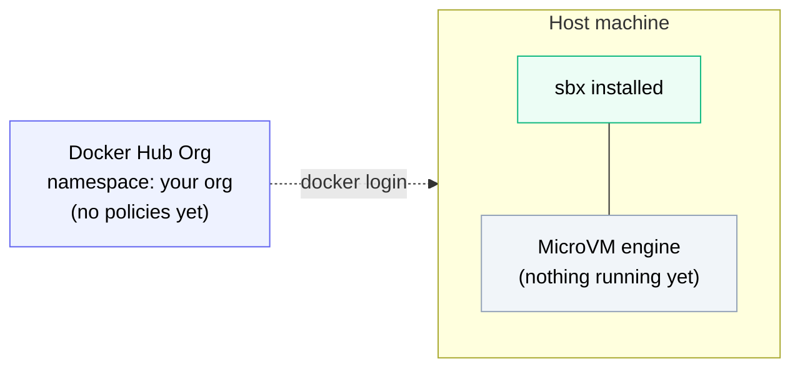

# Setup



*The starting point: a Docker Hub org (just the namespace, no policies yet) and a host with `sbx` installed and its MicroVM engine available. Nothing else has been created — no policies, no secrets, no sandbox.*

Welcome to the Docker AI Governance lab.

Before you start, set the **organization** you'll be using throughout. Most commands and links in later sections substitute `$$org$$` for whatever you set here.

::variableDefinition[org]{prompt="Which Docker Hub organization will you use?"}

Enter your own Docker Hub organization name in the field above. Every `$$org$$` reference in later sections uses whatever you set here.

## What you need

- **`sbx` (Docker Sandboxes)** installed - Docker Desktop is **not** required
- **Admin access** to a Docker Hub organization so you can configure AI governance policies
- **A terminal** in the right-hand panel - most commands are click-to-run

## Pick your operating system

Choose the platform you're running `sbx` on. Later sections use this to show you the right install commands and file paths.

::variableSetButton[🍎 macOS]{variables="os=mac"}
::variableSetButton[🪟 Windows]{variables="os=windows"}
::variableSetButton[🐧 Linux]{variables="os=linux"}

:::conditionalDisplay{variable="os" hasNoValue}
> [!IMPORTANT]
> Pick your operating system above before continuing - the install commands and paths in this lab depend on it.
:::

:::conditionalDisplay{variable="os" hasValue}
> [!TIP]
> You selected **`$$os$$`**. This choice carries through the whole lab. Come back here to switch it any time.
:::

## Quick check

Verify sbx is installed:

```bash no-run-button
sbx version
```

If it's not installed, then run the install command for your platform:

:::conditionalDisplay{variable="os" requiredValue="mac"}
```bash no-run-button
brew install docker/tap/sbx
```
:::

:::conditionalDisplay{variable="os" requiredValue="windows"}
> [!IMPORTANT]
> `sbx` runs **natively** on Windows 11 (x86_64) using the Windows Hypervisor Platform - **not** inside WSL2. Enable the platform first, then reboot before installing.

First enable the Windows Hypervisor Platform (elevated PowerShell), then **reboot** - this changes boot-time kernel components:

```powershell no-run-button
Enable-WindowsOptionalFeature -Online -FeatureName HypervisorPlatform -All
```

After rebooting, install with WinGet:

```powershell no-run-button
winget install -h Docker.sbx
```

Or download `DockerSandboxes.msi` from the [releases page](https://github.com/docker/sbx-releases/releases) and install it:

```powershell no-run-button
msiexec /i DockerSandboxes.msi /quiet
```
:::

:::conditionalDisplay{variable="os" requiredValue="linux"}
On Ubuntu (`.deb`):

```bash no-run-button
sudo apt install ./DockerSandboxes-linux-amd64-ubuntu2604.deb
```

On Rocky Linux 8 (`.rpm`):

```bash no-run-button
sudo dnf install ./DockerSandboxes-linux-amd64-rockylinux8.rpm
```

Or use the Docker apt repository:

```bash no-run-button
curl -fsSL https://get.docker.com | sudo REPO_ONLY=1 sh
sudo apt-get install docker-sbx
```

Grant KVM access so sandboxes can boot, then reload your group membership:

```bash no-run-button
sudo usermod -aG kvm $USER && newgrp kvm
```
:::

Verify you're logged in to Docker:

```bash no-run-button
docker login
```

If you're a member of multiple organizations, make sure the org you set above (`$$org$$`) matches one where you have admin rights - otherwise you won't be able to set policies in Section 03.

When you're ready, move to Section 01.
