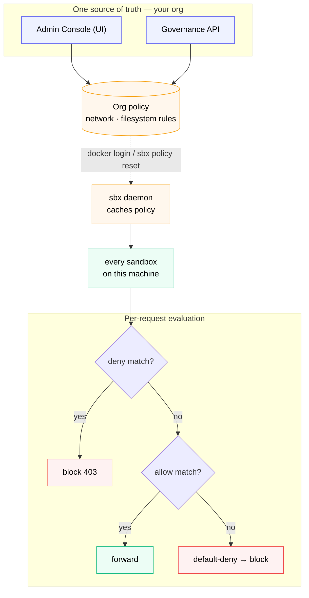

# The Policy Model



*Authored once (UI or API), synced to the daemon at login, cached, and applied to every sandbox. Each request is evaluated deny → allow → default-deny.*

Before you run the live demo, here's the mental model.

## Where policies live

Policies for `$$org$$` live in one place - the org's control plane - but there are **two ways to author them**:

1. **Docker Hub Admin Console (UI)** - point and click at **[app.docker.com/accounts/$$org$$](https://app.docker.com/accounts/$$org$$)** → **AI governance**. Best for a human making a one-off change.
2. **Docker AI Governance API** - the same control plane driven programmatically over HTTP. Best for codifying governance: version control, CI pipelines, and admin tooling. We cover it in the **Governance API** section.

Both paths read and write the **same policies**, **same rules**, **same org** - they're just two front doors to one source of truth. This section and the demos use the Admin Console; everything you do here can be reproduced through the API.

Only org admins can modify policies, whichever path they use. Developers cannot override them locally. That's the point.

## How policies reach developers

When a developer runs `docker login` with org credentials, the Docker client fetches the org's AI governance policies as part of authentication. The local `sbx` daemon caches them and applies them to every sandbox launched on that machine.

```
Admin Console  ──auth flow──▶  Developer machine (sbx daemon)  ──cache──▶  Every sandbox
(one source                                              
 of truth)
```

When the admin changes a policy, developers pick up the change on next sync. To force an immediate refresh:

```bash no-run-button
sbx policy reset
```

(You'll be prompted to choose a default baseline. Pick **Balanced**.)

## How rules evaluate

Rules are evaluated **per request** at the sandbox network proxy. For an outbound HTTP request from inside a sandbox, the proxy checks:

1. Does any **deny** rule match? → Block (403)
2. Does any **allow** rule match? → Forward
3. Otherwise → Default-deny (block)

This means:

- **Explicit deny always wins.** Adding a deny rule for `paste.ee` blocks paste.ee even when a broader allow rule exists.
- **Default-deny posture** means you don't need to enumerate every bad destination. If you didn't explicitly allow it, it's blocked.
- **A `0.0.0.0/0` catch-all allow rule defeats this model** - it permits everything. We'll remove it in the next section if it's present.

## Local vs remote policies

Run this to see what's currently active:

```bash no-run-button
sbx policy ls
```

You'll see two kinds of policies:

| `ORIGIN` column | Meaning |
| --- | --- |
| `local` | Defaults shipped with sbx, or rules you added with `sbx policy allow ...` |
| `remote` | Pulled from your org's Admin Console |

When the org has policies set for a rule type (e.g., network), local rules of that type go **inactive** - you'll see `corporate policy takes precedence and does not delegate this rule type to local policy`.

The CISO has the wheel.

> [!NOTE]
> **Not everything the sandbox enforces is an org policy.** Network and filesystem rules flow from the admin as shown above. **Credential isolation** - keeping real API keys and tokens out of the sandbox - is a sandbox runtime protection you configure **developer-side** (`sbx secret`, the OS keychain, OAuth). It complements these policies rather than being one of them. The dedicated **Credential Isolation** section covers it.

## Confirm governance is active

Look at the top of the `sbx policy ls` output. You should see:

```
Governance: managed by $$org$$
[OK] last synced HH:MM:SS
```

If `Governance` says anything other than `$$org$$`, check that you're logged in with the right account (`docker login`) and that the account is a member of `$$org$$`.

## Set up your lab working directory

Every `sbx run` in this lab launches from a single directory: **`~/workdemo`**. Create it now:

```bash no-run-button
mkdir -p ~/workdemo
```

Then **allowlist it in the filesystem policy** so sandboxes are allowed to mount it. In the Admin Console at **[app.docker.com/accounts/$$org$$](https://app.docker.com/accounts/$$org$$)** → **AI governance** → **Filesystem access**, add:

- Action: **Allow**
- Filesystem path: `~/workdemo/**`
- Action scope: **Read, Write**
- Name: `allow workdemo`

> ⚠️ **Why this is required first.** Filesystem policy is **default-deny** and checked at sandbox-creation time. If `~/workdemo` isn't covered by an allow rule, every `sbx run` in this lab fails before the sandbox even starts:
>
> ```
> ERROR: failed to create sandbox: ... status 403: mount policy denied:
> /Users/<you>/workdemo: no applicable policies for
> op(action=fs:mount:write, resource=fs:path:/Users/<you>/workdemo)
> ```
>
> Add this allow rule before running any demo. Section 04 goes deeper on filesystem enforcement.

After adding the rule, force a sync and confirm it reached your machine:

```bash no-run-button
sbx policy reset    # choose Balanced when prompted
```

That's the model. Now let's prove it works end-to-end.
