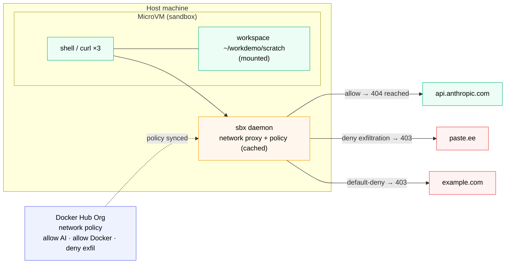

# Network Enforcement Demo



*Three `curl`s, three outcomes: allowed traffic reaches the origin (404), the deny rule blocks paste.ee (403), and default-deny blocks anything unlisted (403) — all decided at the sbx proxy.*

Define network policies - in the Admin Console or scripted through the Governance API - watch them flow to your developer machine, and prove enforcement with three `curl` commands inside a sandbox.

This section proves the network half of Pillar 1. Section 04 proves the filesystem half.

**Time:** ~10 minutes
**Prerequisites:** You're an admin of `$$org$$` and you completed Section 00.

## What you'll prove

- Policies defined in `app.docker.com/accounts/$$org$$` flow automatically to any developer logged in with org credentials
- An **allow** rule lets explicitly-permitted traffic through
- A **deny** rule blocks specific destinations
- The **default-deny posture** blocks anything not covered by an allow rule

## Step 1 - Define the network policy

You can set up the rules two ways. **Both produce the identical policy in `$$org$$`** - pick whichever fits you, then continue to Step 2.

::variableSetButton[🖱️ Admin Console (manual)]{variables="setupMode=console"}
::variableSetButton[⌨️ API / CLI (scripted)]{variables="setupMode=cli"}

:::conditionalDisplay{variable="setupMode" hasNoValue}

> [!NOTE]
> Pick one of the two buttons above to reveal its steps. The choice carries into Section 04.

:::

<!-- ───────────────────────── ADMIN CONSOLE PATH ───────────────────────── -->

:::conditionalDisplay{variable="setupMode" requiredValue="console"}

### Open the Admin Console

Open **[app.docker.com/accounts/$$org$$](https://app.docker.com/accounts/$$org$$)** and navigate to **AI governance** → **Network access**.

Confirm the AI governance toggle is **ON**. If it isn't, turn it on.

### Set up the allow rules

If they're not already present, add two **Allow** rules.

**Rule 1: allow AI services**

- Action: Allow
- Network path (paste these as multiple lines - the modal accepts multi-line input):
  ```
  api.anthropic.com:443
  api.openai.com:443
  platform.claude.com:443
  *.googleapis.com:443
  statsig.anthropic.com:443
  ```
- Protocol: TCP, UDP
- Name: `allow AI services`

**Rule 2: allow Docker services**

- Action: Allow
- Network path:
  ```
  *.docker.com:443
  *.docker.io:443
  dhi.io:443
  ```
- Protocol: TCP, UDP
- Name: `allow Docker services`

### Add the deny rule

This is the rule that makes the demo land for security teams.

- Action: **Deny**
- Network path:
  ```
  paste.ee
  pastebin.com
  hooks.slack.com
  ```
- Protocol: TCP, UDP
- Name: `deny exfiltration`

### Remove any catch-all rule

If a rule exists with paths `0.0.0.0/0` or `::/0` (often labelled "allow all IPs"), **delete it**. Click the red trash icon on that row.

A catch-all `0.0.0.0/0` allow means everything is permitted regardless of other rules - the deny rule has nothing to prove. Removing it activates the default-deny posture.

After this, the final rule list should have exactly **three rules**:

- allow AI services (Allow)
- allow Docker services (Allow)
- deny exfiltration (Deny)

:::

<!-- ───────────────────────── API / CLI PATH ───────────────────────── -->

:::conditionalDisplay{variable="setupMode" requiredValue="cli"}

The **Docker AI Governance API** (covered end-to-end in the Governance API section) creates the exact same rules from your terminal. A helper script wraps the `curl` calls so you provision everything in one shot - the foundation for governance-as-code.

> [!IMPORTANT]
> **Enable the AI governance toggle first.** The API creates policies even when the feature is off, but they stay dormant until you enable it — the tell-tale symptom is Step 4 returning `anthropic: 403`. Open **[app.docker.com/accounts/$$org$$](https://app.docker.com/accounts/$$org$$)** → **AI governance** and confirm the toggle is **ON** before running the script.

### Get an admin token

All API calls use a JWT bearer token tied to an org owner/admin. Exchange a Personal Access Token (preferred) or your password for one.

Run this in your terminal to mint a token and export it for the session:

> [!WARNING]
> A Personal Access Token is a secret. Enter it only at the silent prompt below - prefer a scoped PAT over your account password so it can be revoked.

```bash no-run-button
printf "Docker Hub username: "
read -r DOCKER_USER
printf "Personal Access Token: "
stty -echo; read -r DOCKER_PAT; stty echo; printf "\n"

RESPONSE="$(curl -fsS -X POST https://hub.docker.com/v2/users/login \
  -H "Content-Type: application/json" \
  -d "{\"username\":\"$DOCKER_USER\",\"password\":\"$DOCKER_PAT\"}")"

export ORG=$$org$$
if command -v jq >/dev/null 2>&1; then
  export TOKEN="$(printf '%s' "$RESPONSE" | jq -r '.token')"
else
  export TOKEN="$(printf '%s' "$RESPONSE" | grep -o '"token":"[^"]*"' | sed 's/.*:"//;s/"$//')"
fi

[ -n "$TOKEN" ] && [ "$TOKEN" != "null" ] && echo "Token captured." || echo "Failed to get token - check your username/PAT."
```

### Run the policy setup script

Download and run the helper. With no argument it provisions **both** the network and filesystem policies, so a single run covers Section 03 **and** Section 04:

```bash no-run-button
curl -fsSL https://raw.githubusercontent.com/ajeetraina/labspace-docker-ai-governance/main/labspace/assets/setup-policies.sh -o setup-policies.sh
bash setup-policies.sh
```

The script creates a policy named **`Labspace AI Governance - network`** with the same three rules as the manual path:

- `allow AI services` (allow) - Anthropic, OpenAI, Google, and Docker AI endpoints
- `allow Docker services` (allow) - `*.docker.com`, `*.docker.io`, `dhi.io`
- `deny exfiltration` (deny) - `paste.ee`, `pastebin.com`, `hooks.slack.com`

...plus the **`Labspace AI Governance - filesystem`** policy used in Section 04 (`allow lab test directory`, `deny credentials`).

> [!TIP]
> Because the API creates a fresh allowlist policy, there's **no catch-all `0.0.0.0/0` rule to remove** - the default-deny posture is active from the start. Re-running the script is safe: existing rules are detected by name and skipped. To scope a single domain, pass `network` or `filesystem` as an argument.

:::

## Step 2 - Verify policies reached your machine

Back on your terminal:

```bash no-run-button
sbx policy reset
```

When prompted, choose **Balanced** (option 2).

Then list active policies:

```bash no-run-button
sbx policy ls
```

You should see:

- A header reading `Governance: managed by $$org$$`
- A fresh sync timestamp
- Three rules with `ORIGIN: remote` matching what you just defined (Console or API)
- Several `default-*` rules marked `inactive - corporate policy takes precedence`

That last line is the central control proof. Even though sbx ships with sensible defaults, the org policy is overriding them.

> [!TIP]
> `sbx policy ls` gets long once your org has many rules. Filter it:
>
> ```bash no-run-button
> sbx policy ls | grep -i anthropic                          # is Anthropic allowed?
> sbx policy ls | grep -iE "network|PROVENANCE|Governance"   # network rules only
> sbx policy ls | grep -iE "paste|anthropic|docker"          # specific hosts
> ```
>
> A row with `api.anthropic.com:443` and `remote` means your allow rule synced → Step 4 lets Anthropic through.

## Step 3 - Spin up a sandbox

```bash no-run-button
mkdir -p ~/workdemo/scratch && cd ~/workdemo/scratch
sbx run shell .
```

This creates an isolated microVM with `shell` as the agent and the current directory as the workspace. Outbound network from the sandbox goes through the proxy that enforces your org policies.

We use `~/workdemo/scratch` as the workspace because Section 04 (Filesystem Enforcement Demo) allows `~/workdemo/**` - so a single filesystem rule covers both labs.

You'll land at a shell prompt inside the sandbox.

> [!WARNING]
> **If creation fails with `403 ... mount policy denied`:** `sbx run shell .` mounts the current directory, which must be covered by a filesystem allow rule. If you ran `setup-policies.sh` (API/CLI path), it already exists. Otherwise add one — **AI governance → Filesystem access** → Allow `~/workdemo/**` (Read, Write) → `sbx policy reset` — and re-run. Section 04 covers this in full.

## Step 4 - Run the three enforcement tests

Inside the sandbox prompt:

```bash no-run-button
curl -sS https://api.anthropic.com -o /dev/null -w "anthropic: %{http_code}\n"
curl -sS https://paste.ee -o /dev/null -w "paste.ee: %{http_code}\n"
curl -sS https://example.com -o /dev/null -w "example.com: %{http_code}\n"
```

## Step 5 - Read the results

Expected output (codes may vary slightly):

```
anthropic: 404
paste.ee: 403
example.com: 403
```

> [!NOTE]
> **`anthropic: 404` is the success signal, not an error.** The bare root `https://api.anthropic.com` has no handler, so once the proxy lets it through Anthropic replies `404` (the `200` in some older docs was wrong). What matters is **404 vs 403**: any non-`403` reply (`404`/`401`/`405`) means you *reached* Anthropic → allowed; `403` means the sbx proxy refused it. Seeing `403`? Your allow rule isn't active — check `sbx policy ls | grep -i anthropic` and the AI governance toggle.

| Destination | Code | What it means |
| --- | --- | --- |
| `api.anthropic.com` | 404 (or 401/405) | The connection reached Anthropic's servers — the bare root has no handler, so Anthropic replies `404`. The point is the **sbx proxy let it through** because `allow AI services` covers it. Any non-`403` origin reply proves it. |
| `paste.ee` | 403 | The **sbx proxy refused** the request. paste.ee never received the connection. Your `deny exfiltration` rule blocked it. |
| `example.com` | 403 | The **sbx proxy refused** the request. No allow rule covers it, so the default-deny posture catches it. |

The distinction between 200/404 (origin server replied) and 403 (proxy refused) is what proves enforcement happens at the policy layer, not at the destination.

## Step 6 - See the proxy refusal up close (optional)

For a more visceral demo, run a verbose `curl` from inside the sandbox:

```bash no-run-button
curl -v https://paste.ee 2>&1 | head -50
```

You'll see the sbx proxy intercept the request in three distinct phases:

**1. The proxy variable** - the sandbox routes outbound traffic through `gateway.docker.internal:3128`:

```
* Uses proxy env variable https_proxy == 'http://gateway.docker.internal:3128'
```

**2. The CONNECT tunnel succeeds** - counter‑intuitively, the proxy returns `HTTP/1.0 200 OK` to the `CONNECT` request. It accepts the tunnel so it can do content inspection:

```
> CONNECT paste.ee:443 HTTP/1.1
< HTTP/1.0 200 OK
* CONNECT tunnel established, response 200
```

**3. The MITM cert is the smoking gun** - the TLS handshake completes, but the server certificate is *not* from Let's Encrypt or paste.ee's real issuer. It's an impersonation cert minted by the sbx proxy:

```
* Server certificate:
*   subject: O=GoProxy untrusted MITM proxy Inc; CN=paste.ee
```

That `O=GoProxy untrusted MITM proxy Inc` is the proxy openly identifying itself. paste.ee never received the connection - the proxy terminated the TLS itself, inspected the request inside the tunnel, matched the `deny exfiltration` rule, and returned `HTTP/1.1 403 Forbidden`.

To see the 403 itself, lengthen the head:

```bash no-run-button
curl -v https://paste.ee 2>&1 | head -80 | tail -30
```

You'll see `< HTTP/1.1 403 Forbidden` after the TLS handshake - proof that the policy was enforced inside the MITM tunnel, before the request was forwarded anywhere.

For contrast, from your **host machine** (outside the sandbox), the same `curl -v https://paste.ee` shows a normal Let's Encrypt cert and reaches the real paste.ee. Policy enforcement is sandbox‑scoped - that's by design.

## Step 7 - Exit the sandbox

```bash no-run-button
exit
```

The microVM is torn down. Everything inside it is gone unless it was written to the mounted workspace.

## What you just demonstrated

The full Pillar 1 story end-to-end:

1. **One source of truth** - policies defined once for `$$org$$`, whether through the Admin Console or the Governance API
2. **Automatic propagation** - every developer logged in with org credentials inherits the policies
3. **Real enforcement** - the network proxy actually blocked the deny destination and the unscoped destination, while letting allowed traffic through
4. **No developer override** - local rules went inactive in favour of the org rules

Three rules and three `curl`s - and you have a working enforcement story you can defend to a security team. Define them by hand for a demo, or script them with `setup-policies.sh` to put governance in version control.

Move on to Section 04 to prove the filesystem half of the same model.
