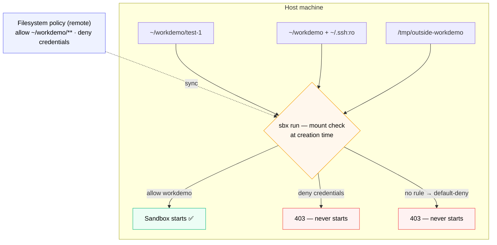

# Filesystem Enforcement Demo



*Filesystem rules are checked **at sandbox creation**, not at read time. An allowed path mounts and the sandbox starts; a denied or unlisted path fails with 403 and the sandbox never exists.*

Network was the first half of Pillar 1. Filesystem is the other half - and arguably the more visceral one for security teams. *"The agent can't steal SSH keys"* lands harder than *"the agent can't reach paste.ee."*

**A key difference from Section 03:** filesystem rules are checked **at sandbox creation time**, not at file-access time inside the sandbox. The sandbox refuses to be created with a denied mount, instead of letting it in and blocking reads later. That's a stronger model - the denied mount never exists inside the sandbox.

**Time:** ~10 minutes
**Prerequisites:** You completed Section 03.

## What you'll prove

- Sandbox creation **fails** for paths not covered by any allow rule (default-deny)
- Sandbox creation **fails** when an additional mount targets a denied path
- Sandbox creation **succeeds** for paths in an allow rule
- Read and Write are scoped independently at the mount layer

## Step 1 - Define the filesystem policy

Same two paths as Section 03 - your earlier choice carries over, but you can switch here.

::variableSetButton[🖱️ Admin Console (manual)]{variables="setupMode=console"}
::variableSetButton[⌨️ API / CLI (scripted)]{variables="setupMode=cli"}

:::conditionalDisplay{variable="setupMode" hasNoValue}

> [!NOTE]
> Pick one of the two buttons above to reveal its steps.

:::

<!-- ───────────────────────── ADMIN CONSOLE PATH ───────────────────────── -->

:::conditionalDisplay{variable="setupMode" requiredValue="console"}

### Open the Admin Console

Open **[app.docker.com/accounts/$$org$$](https://app.docker.com/accounts/$$org$$)** and navigate to **AI governance** → **Filesystem access**.

The page works the same way as Network access, but rules are scoped to paths (with glob support) and actions (Read / Write).

## Step 2 - Confirm the allow rule for your working directory

You need at least one allow rule so the sandbox can be created. You already added this in Section 02:

- Action: **Allow**
- Filesystem path: `~/workdemo/**`
- Action scope: **Read, Write**
- Name: `allow workdemo`

The `**` matches recursively. If you skipped Section 02, add it now. You can add other allow rules for `~/code/`, etc., but the dedicated `~/workdemo` directory keeps the lab isolated.

### Add the deny rule

This is the rule that earns its keep.

- Action: **Deny**
- Filesystem path:
  ```
  ~/.ssh/**
  ~/.aws/**
  ~/.config/gcloud/**
  ~/.kube/config
  ~/.docker/config.json
  ```
- Action scope: **Read, Write** (both)
- Name: `deny credentials`

That covers SSH keys, AWS creds, GCloud creds, K8s config, and Docker registry auth - the five places agents most commonly leak secrets from.

### Remove any catch-all

If a rule exists with path `~/**` or `/**` and action Allow, **delete it**. A catch-all allow defeats every deny rule - same trap as Network.

:::

<!-- ───────────────────────── API / CLI PATH ───────────────────────── -->

:::conditionalDisplay{variable="setupMode" requiredValue="cli"}

If you ran `setup-policies.sh` with **no argument** in Section 03, the filesystem policy is **already created** - jump straight to Step 2.

To create it on its own, make sure `ORG` and `TOKEN` are still exported. The block below reuses the token from Section 03 if it's still set, and only prompts for your username and PAT when one isn't found (the PAT is read silently, so it never appears on screen):

> [!WARNING]
> A Personal Access Token is a secret. Enter it only at the silent prompt below - prefer a scoped PAT over your account password so it can be revoked.

```bash no-run-button
export ORG=$$org$$

if [ -n "$TOKEN" ] && [ "$TOKEN" != "null" ]; then
  echo "Reusing the token from Section 03."
else
  printf "Docker Hub username: "
  read -r DOCKER_USER
  printf "Personal Access Token: "
  stty -echo; read -r DOCKER_PAT; stty echo; printf "\n"

  RESPONSE="$(curl -fsS -X POST https://hub.docker.com/v2/users/login \
    -H "Content-Type: application/json" \
    -d "{\"username\":\"$DOCKER_USER\",\"password\":\"$DOCKER_PAT\"}")"

  if command -v jq >/dev/null 2>&1; then
    export TOKEN="$(printf '%s' "$RESPONSE" | jq -r '.token')"
  else
    export TOKEN="$(printf '%s' "$RESPONSE" | grep -o '"token":"[^"]*"' | sed 's/.*:"//;s/"$//')"
  fi

  [ -n "$TOKEN" ] && [ "$TOKEN" != "null" ] && echo "Token captured." || echo "Failed to get token - check your username/PAT."
fi
```

Then run the helper scoped to the filesystem domain:

```bash no-run-button
curl -fsSL https://raw.githubusercontent.com/ajeetraina/labspace-docker-ai-governance/main/labspace/assets/setup-policies.sh -o setup-policies.sh
bash setup-policies.sh filesystem
```

This creates a policy named **`Labspace AI Governance - filesystem`** with the same two rules as the manual path:

- `allow workdemo` (allow, read + write) - `~/workdemo/**`
- `deny credentials` (deny, read + write) - `~/.ssh/**`, `~/.aws/**`, `~/.config/gcloud/**`, `~/.kube/config`, `~/.docker/config.json`

A fresh allowlist policy has no catch-all to remove, so the default-deny posture is active from the start. Re-running is safe - rules already present are detected by name and skipped.

:::

## Step 2 - Verify policies reached your machine

```bash no-run-button
sbx policy reset
```

Choose **Balanced** when prompted.

```bash no-run-button
sbx policy ls
```

Scroll to filesystem rules. You should see `allow workdemo` and `deny credentials` with `ORIGIN: remote`.

To see **every** filesystem rule that could apply — including inactive ones and any left over from earlier experiments — add `--include-inactive`:

```bash no-run-button
sbx policy ls --include-inactive
```

The filesystem rows look like this (your exact set will vary):

```
PROVENANCE   APPLIES_TO   POLICY/RULE                                              TYPE               DECISION   RESOURCES
remote       all          allowwork / allowwork                                    filesystem:write   allow      /Users/ajeetraina/work/**
remote       all          workdemo / workdemo                                      filesystem:write   allow      /Users/ajeetraina/workdemo/**
remote       all          labproject / validatekit                                 filesystem:write   allow      /Users/ajeetraina/.labspace/project/**
remote       all          allowcodexx / allowcodex                                 filesystem:write   allow      C:\Users\ajeet\work
remote       all          allowscratch / allowscratch                              filesystem:write   allow      /Users/ajeetraina/scratch
remote       all          allowfs / allowfs                                        filesystem:write   allow      ~/labspace-fs-test/**
remote       all          Labspace AI Governance - filesystem / allow workdemo     filesystem:write   allow      ~/workdemo/**
remote       all          Labspace AI Governance - filesystem / deny credentials   filesystem:write   deny       ~/.aws/**
                                                                                                                 ~/.config/gcloud/**
                                                                                                                 ~/.docker/config.json
                                                                                                                 ~/.kube/config
                                                                                                                 ~/.ssh/**
remote       all          allowin / allowinn                                       filesystem:write   allow      C:\Users\ajeet\Downloads\sbx-kits-box-main\*
```

Reading the columns:

- **PROVENANCE** `remote` — the rule came from org governance (Docker Hub), not a local override. These are authoritative; a developer can't disable them.
- **APPLIES_TO** `all` — applies to every principal in the org.
- **POLICY/RULE** — the policy name and the individual rule inside it (e.g. `Labspace AI Governance - filesystem / deny credentials`).
- **TYPE** / **DECISION** — the action class (`filesystem:write`) and `allow` or `deny`.
- **RESOURCES** — the path globs the rule matches; a `deny` rule lists each protected path on its own line.

The two rows that drive this demo are `Labspace AI Governance - filesystem / allow workdemo` (allow `~/workdemo/**`) and `… / deny credentials` (deny the five secret paths). The other rows are leftover allow rules from earlier experiments — harmless here, but a good reminder that **`deny` always wins**: even with all those allows, `deny credentials` still blocks `~/.ssh` in Test 2.

## Step 3 - Create the test directories

Three separate workdirs so each `sbx run` creates a fresh sandbox without name collision. Two live under the allowed `~/workdemo`; the third is deliberately **outside** it to prove default-deny:

```bash no-run-button
mkdir -p ~/workdemo/test-1
mkdir -p ~/workdemo/test-2
mkdir -p /tmp/outside-workdemo
```

## Step 4 - Test 1: Allowed workdir, no extra mounts

```bash no-run-button
cd ~/workdemo/test-1
sbx run shell .
```

The sandbox starts and you land at the shell prompt. Write a file to prove the mount is real and read-write, then exit:

```bash no-run-button
echo "hello from the agent" > proof.txt
exit
```

Back on the host, the write persisted at the allowed path:

```bash no-run-button
cat ~/workdemo/test-1/proof.txt
```

✅ The `allow workdemo` rule permits the mount — creation succeeds, and reads/writes work inside it.

## Step 5 - Test 2: Allowed workdir + denied extra mount

```bash no-run-button
cd ~/workdemo/test-2
sbx run shell . ~/.ssh:ro
```

**Expected error:**

```
ERROR: failed to create sandbox: ... status 403: mount policy denied:
/Users/<you>/.ssh: ... action=fs:mount:read,
resource=fs:path:/Users/<you>/.ssh
```

✅ The sandbox **never starts**. The `deny credentials` rule blocks `~/.ssh:ro` at creation.

## Step 6 - Test 3: Unallowed workdir (default-deny)

```bash no-run-button
cd /tmp/outside-workdemo
sbx run shell .
```

**Expected error:**

```
ERROR: failed to create sandbox: ... status 403: mount policy denied:
/private/tmp/outside-workdemo: no applicable policies for
op(action=fs:mount:write, resource=fs:path:/private/tmp/outside-workdemo)
```

✅ The sandbox **never starts**. No allow rule covers `/tmp/outside-workdemo`, default-deny applies.

:::conditionalDisplay{variable="os" requiredValue="mac"}
> Note: macOS resolves `/tmp` to `/private/tmp` - the policy engine sees the canonical path, which is why the error above shows `/private/tmp/...`.
:::

:::conditionalDisplay{variable="os" requiredValue="linux"}
> Note: on Linux `/tmp` is already canonical, so the error shows `/tmp/outside-workdemo` directly (no `/private` prefix like macOS).
:::

:::conditionalDisplay{variable="os" requiredValue="windows"}
> Note: on Windows, `sbx` runs under WSL2, so these paths are the Linux paths *inside* WSL - `/tmp` is canonical there. The policy engine always evaluates the canonical path it resolves.
:::

:::conditionalDisplay{variable="os" hasNoValue}
> Note: the policy engine evaluates the *canonical* path. macOS resolves `/tmp` to `/private/tmp` (hence the error above); on Linux/WSL `/tmp` is already canonical.
:::

## Step 7 - Read the results

| Test | Workdir | Extra mount | Outcome | Why |
| --- | --- | --- | --- | --- |
| 1 | `~/workdemo/test-1` | none | Sandbox starts | Covered by `allow workdemo` |
| 2 | `~/workdemo/test-2` | `~/.ssh:ro` | 403, no sandbox | Blocked by `deny credentials` |
| 3 | `/tmp/outside-workdemo` | none | 403, no sandbox | No applicable policy → default-deny |

Same three-decision pattern as the network demo, just at a different layer:

| Layer | Pattern |
| --- | --- |
| Network (Section 03) | curl gets 200/404 (allowed) or 403 (denied) |
| Filesystem (this section) | sandbox creation succeeds (allowed) or fails with 403 (denied) |

## Cleanup (optional)

If you want to remove the test sandboxes between runs:

```bash no-run-button
sbx ls
```

Then remove the entries listed. Cleanup subcommand varies by sbx version - check `sbx --help` for `rm`, `delete`, or `stop`.

## What you just demonstrated

The policy engine **prevents the sandbox from being created** with a denied mount. Enforcement happens *before* the agent ever runs.

This is stronger than runtime filtering - no race condition where the agent might briefly see denied data, no partial reads, no leaked file handles. The denied mount simply never exists in the sandbox.

Combined with Section 03, Pillar 1 is now proven end-to-end:

- **Network egress** - agent can't reach unapproved destinations (proxy intercept)
- **Filesystem access** - agent can't even mount unapproved paths (creation-time denial)

You've now blocked the agent from reading secrets off disk. Next, **Credential Isolation** shows how the agent uses the secrets it *is* allowed to - API keys, tokens, SSH - without the real values ever entering the sandbox.
