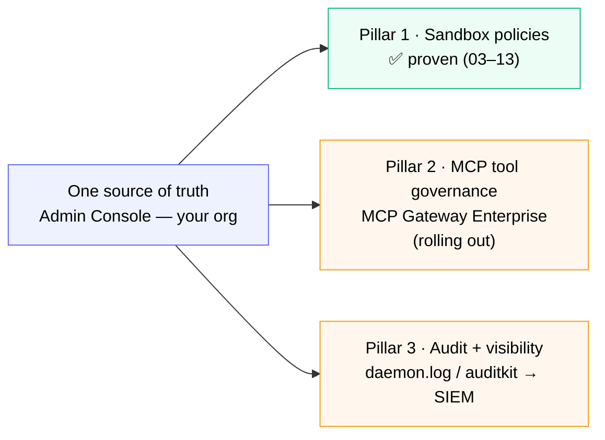

# What's Next



*Where the three pillars stand: you proved Pillar 1 end-to-end; Pillars 2 and 3 share the same engine and source of truth and are landing on `sbx` now.*

You just proved **Pillar 1 - Sandbox Policies** end-to-end. Here's how Pillars 2 and 3 fit in.

> ⚠️ **Roadmap content.** The CLI surface for audit and MCP governance is still landing on `sbx`. The descriptions below explain the model and point to where each pillar lives today. Validate against your installed version as features ship.

## Pillar 2 - MCP Tool Governance

MCP (Model Context Protocol) servers give agents access to tools - GitHub, Notion, your internal APIs, custom servers your team builds. Each tool is a new attack surface.

Docker AI Governance lets org admins define:

- **Which MCP servers** are approved for agents in `$$org$$`
- **Which tools** within each server are usable
- **Which catalogs** developers can pull from (curated Hub catalog vs. open public sources)
- **How secrets are injected** per request, never persisted on the agent

This is the **MCP Gateway Enterprise** layer. It sits between agent and tool, evaluating every call against the same policy engine that enforces sandbox network rules in Section 03.

**Where to see it today:** The MCP Gateway Enterprise control plane is rolling out. Check [docker.com/products/ai-governance](https://www.docker.com/products/ai-governance/) for current availability and your org's enablement status.

## Pillar 3 - Audit and Visibility

Every policy decision - allow or deny, network or filesystem or MCP - generates a structured audit event. Conceptually:

```json
{
  "timestamp": "2026-06-01T01:35:22Z",
  "user": "ajeetraina777",
  "org": "$$org$$",
  "sandbox_id": "sbx_abc123",
  "rule_type": "network",
  "rule_name": "deny exfiltration",
  "decision": "deny",
  "resource": "paste.ee:443",
  "agent": "shell"
}
```

These events stream to your existing SIEM (Splunk, Datadog, Elastic, Sentinel) for retention, alerting, and compliance reporting.

**Where to see it today:**

- **Admin Console** - for `$$org$$`, the Activity / Audit logs view shows org-level policy and access events (when enabled for your plan)
- **Local daemon log** - runtime decisions on this machine are streamed to the sbx daemon log. For ad-hoc inspection during demos:

```bash no-run-button
tail -50 ~/Library/Application\ Support/com.docker.sandboxes/sandboxes/sandboxd/daemon.log
```

This is **not** a polished audit surface - it's the raw daemon log. But after running the Section 03 and Section 04 enforcement tests, you can grep it for the paste.ee, example.com, and credential-access denials to see the underlying machinery in action:

```bash no-run-button
grep -iE "paste\.ee|example\.com|deny|block" ~/Library/Application\ Support/com.docker.sandboxes/sandboxes/sandboxd/daemon.log | tail -20
```

A dedicated `sbx audit` CLI with structured query, export, and SIEM integration is on the roadmap.

## The complete three-pillar picture

| Pillar | What it controls | Where it's enforced | Where to see it today |
| --- | --- | --- | --- |
| 1. Sandbox policies | Network, filesystem, resource limits | Network proxy, mount layer | **Validated in Sections 03 + 04** |
| 2. MCP tool governance | Which tools agents can call | MCP Gateway Enterprise | Admin Console (rolling out) |
| 3. Audit + visibility | Every policy decision logged | Audit event stream → SIEM | Admin Console + daemon log |

All three share **one policy engine** and **one source of truth** - the Admin Console for `$$org$$`.

## Where to go from here

- **Product page:** [docker.com/products/ai-governance](https://www.docker.com/products/ai-governance/)
- **Docker docs:** [docs.docker.com](https://docs.docker.com) - check for the latest AI governance documentation
- **The accompanying deck** covers the policy framework and supporting architecture in more depth

## Quick recap

You proved:

- Policies defined once in the Admin Console flow automatically to every developer's `sbx`
- Three rules - two allows and one deny - enforce a real security model
- The default-deny posture catches anything you didn't explicitly approve
- Developers can't override the policies locally - the CISO retains control

That's the working version of "AI governance" you can defend to a security team.
