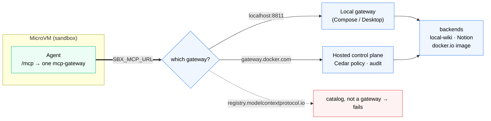
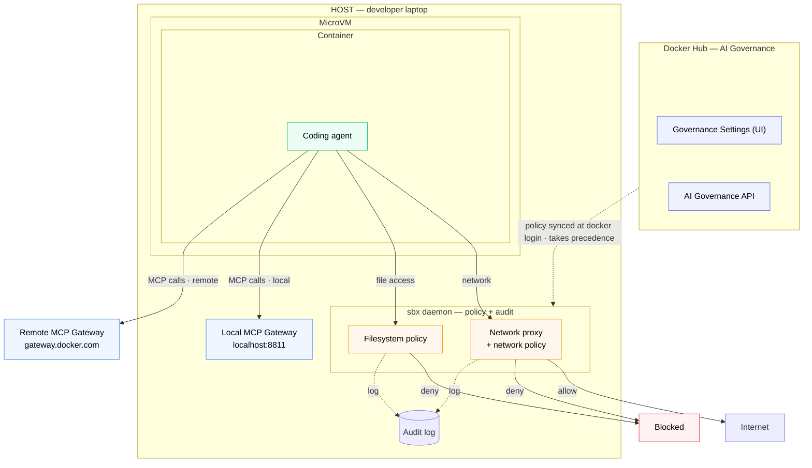

# MCP Hands-On - Registering Servers with `sbx mcp`



*`SBX_MCP_URL` must point at a real gateway — local or Docker-hosted. The agent talks to one aggregated `mcp-gateway`, every backend sits behind it, and the public registry is a catalog that can't carry the flow. (Full architecture diagram below.)*

Section 05 framed **Pillar 2 - MCP Tool Governance** as roadmap. This section gets your hands on the part that's already shipping: the `sbx mcp` subcommand for registering MCP servers, fronted by the **Docker MCP Gateway**, that your sandboxed agents can call.

By the end you will have:

- An `sbx` with the `mcp` subtree enabled
- A **gateway** fronting your servers - run one locally, or use Docker's hosted control plane
- A registered MCP server, attached to a sandbox, and **verified inside the agent**

**Time:** ~15 minutes
**Prerequisites:** Sections 00 and 01, plus `sbx login`.

## Where this fits — the overall architecture

Policy is authored centrally in **Docker Hub → AI Governance** (the Settings UI
or the AI Governance API) and synced to the laptop at `docker login` — it takes
precedence; developers can't override it. The coding agent runs in a **container
inside a MicroVM** on the host, and all enforcement — **network proxy, network
policy, and filesystem policy** — lives on the host in the `sbx` daemon, *around*
the sandbox. The **MCP Gateway** the agent calls (set by `SBX_MCP_URL`) is either
**local** (on your laptop) or **remote** (Docker-hosted). Every decision is audited.



> [!TIP]
> Full version — policy authoring, the MCP Gateway, and the audit stream:
> [overall architecture](assets/architecture.md).

## The one concept: `SBX_MCP_URL` must point at a gateway

The `sbx mcp` command exists in recent `sbx` builds but is **hidden** until an environment variable enables it:

```
SBX_MCP_URL is not set; MCP is not enabled
```

Setting `SBX_MCP_URL` to an absolute http/https URL does two things: it **unlocks** the `mcp` subtree in `sbx --help`, and it tells `sbx` **which gateway** to talk to. That gateway is what provisions the connection, proxies tool calls, and applies governance.

> [!IMPORTANT]
> **Point `SBX_MCP_URL` at a real gateway** — a local one (`http://localhost:8811`) or Docker's hosted control plane (`https://gateway.docker.com`). Not the public MCP registry (`registry.modelcontextprotocol.io`): a registry is a catalog, not a gateway, so `sbx mcp add` appears to work but attaching fails (`501` / "No MCP servers configured").

## Step 1 - Install or upgrade `sbx`

The stable release may lag behind on MCP features - use the latest build for your platform.

:::conditionalDisplay{variable="os" hasNoValue}
> [!TIP]
> Set your operating system back in **Section 00 - Setup** to see the right install command here.
:::

:::conditionalDisplay{variable="os" requiredValue="mac"}
Use the nightly Homebrew tap:

```bash no-run-button
brew install docker/tap/sbx@nightly
```

If you already have stable installed, switch the symlink:

```bash no-run-button
brew unlink sbx 2>/dev/null; brew link --overwrite sbx@nightly
```
:::

:::conditionalDisplay{variable="os" requiredValue="windows"}
Grab the latest pre-release `DockerSandboxes.msi` from the [releases page](https://github.com/docker/sbx-releases/releases) and install it:

```powershell no-run-button
msiexec /i DockerSandboxes.msi /quiet
```
:::

:::conditionalDisplay{variable="os" requiredValue="linux"}
Grab the latest pre-release `.deb`/`.rpm` asset from the [releases page](https://github.com/docker/sbx-releases/releases) and install it, e.g.:

```bash no-run-button
sudo apt install ./DockerSandboxes-linux-amd64-ubuntu2604.deb
```
:::

Verify your version:

```bash no-run-button
sbx version
```

## Step 2 - Choose your gateway

Pick one of the two methods below. Both end with `SBX_MCP_URL` exported and the `sbx mcp` subtree unlocked - the rest of the lab is identical either way.

::variableSetButton[🐳 Method 1 - Local gateway]{variables="gw=local"}
::variableSetButton[🏢 Method 2 - gateway.docker.com]{variables="gw=hosted"}

:::conditionalDisplay{variable="gw" hasNoValue}

> [!NOTE]
> Pick one of the two buttons above to reveal its steps.
> - **Method 1 (local gateway)** is self-contained, works offline, and needs no org enablement - best for learning the mechanics.
> - **Method 2 (`gateway.docker.com`)** is **MCP Gateway Enterprise**: the org-governed path where policy and audit actually apply.

:::

<!-- ───────────────────────── METHOD 1: LOCAL GATEWAY ───────────────────────── -->

:::conditionalDisplay{variable="gw" requiredValue="local"}

### Method 1 - run a local Docker MCP Gateway

You need a gateway listening on `localhost:8811`. Get one **either** way below - they produce the same gateway.

#### Option A - Compose (self-contained, no Docker Desktop needed)

The open-source [`docker/mcp-gateway`](https://github.com/docker/mcp-gateway) is the data plane - it proxies MCP traffic to backing servers. Pull the lab's Compose file and start it:

```bash no-run-button
mkdir -p ~/workdemo/mcp-gateway-lab && cd ~/workdemo/mcp-gateway-lab
curl -fsSL https://raw.githubusercontent.com/ajeetraina/labspace-docker-ai-governance/main/labspace/assets/mcp-gateway-compose.yaml -o compose.yaml
docker compose up -d
```

> [!TIP]
> **Docker CE / WSL2 without Docker Desktop:** if the gateway errors with `Docker Desktop is not running`, set `export DOCKER_MCP_IN_CONTAINER=1` before `docker compose up -d`.

#### Option B - Docker Desktop MCP Toolkit

Docker Desktop **4.62+** ships the *same* gateway, managed for you:

1. **Docker Desktop → Settings → MCP Toolkit** → enable it.
2. In the **MCP Toolkit** view, enable at least one server (e.g. **DuckDuckGo**) so the gateway has something to proxy.
3. Leave Desktop running - the gateway stays up on `localhost:8811`.

#### Point `sbx` at it

```bash no-run-button
export SBX_MCP_URL=http://localhost:8811
sbx daemon stop && sbx daemon start -d
```

:::

<!-- ───────────────────────── METHOD 2: CONNECT.DOCKER.COM ───────────────────────── -->

:::conditionalDisplay{variable="gw" requiredValue="hosted"}

### Method 2 - Docker's hosted control plane (`gateway.docker.com`)

The endgame of **Pillar 2**: instead of running your own `localhost:8811`, `SBX_MCP_URL` points at Docker's **hosted MCP control plane**, which provisions a governed gateway per sandbox - the same control plane that enforces the network and filesystem policies you proved in Sections 03-04. This is **MCP Gateway Enterprise**.

There's nothing to stand up - point `sbx` at it and restart the daemon:

```bash no-run-button
export SBX_MCP_URL=https://gateway.docker.com
sbx daemon stop && sbx daemon start -d
```

When you attach a server (Step 4), the daemon calls this control plane to provision a gateway and the agent connects to it. A successful attach logs a clean `200` and `mcp gateway started ... backends:N` in `sandboxd/daemon.log`. The gateway can **reject** a registration that violates org policy, inject backend secrets per request, and write every tool call to the audit trail (Section 10). Check [docker.com/products/ai-governance](https://www.docker.com/products/ai-governance/) for your org's enablement status.

:::

### Confirm the subtree is unlocked

Either method leaves `SBX_MCP_URL` exported. Confirm the commands appear:

```bash no-run-button
sbx mcp --help
```

```
Available Commands:
  add         Register an MCP server
  auth        Authorize MCP servers
  bundle      Manage MCP server bundles
  inspect     Show MCP server details
  load        Load an already-registered MCP server into a running sandbox
  ls          List registered MCP servers
  rm          Remove a registered MCP server
```

Note `load` (attaches into a **running** sandbox) and that the attach flag on `sbx run` is `--static-mcp`, **not** `--mcp` (Step 4).

## Step 3 - Register a server

We'll register the Wikipedia MCP server as a **local stdio** container - the most reliable path, needs nothing beyond your machine:

```bash no-run-button
sbx mcp add local-wiki --command docker --args "run,-i,--rm,mcp/wikipedia-mcp"
```

`--command` is an executable path (not a shell string) and `--args` is a **comma-separated** list - these map to `docker run -i --rm mcp/wikipedia-mcp`. Confirm it landed:

```bash no-run-button
sbx mcp ls
sbx mcp inspect local-wiki
```

`sbx mcp inspect` shows only the registration record, not live tools — the real proof comes inside the agent in Step 5.

> [!WARNING]
> **Local stdio servers run on the HOST, not in the sandbox** — with your full user permissions. Use them for development, not untrusted code. This is exactly the risk the gateway exists to govern.

Two other registration modes work the same way against either gateway:

- **Remote OAuth:** `sbx mcp add notion --url https://mcp.notion.com/mcp` (must be `https`; add `--skip_auth` to register before completing OAuth).
- **docker.io image:** `sbx mcp add ddg-image --url docker.io/mcp/duckduckgo` (OCI refs must be on `docker.io`; the gateway pulls and runs it with container isolation).

## Step 4 - Attach the server to a sandbox

> [!WARNING]
> Registering only *records* the server — attaching is separate. The attach flag is **`--static-mcp`**, not `--mcp` (`--mcp` fails with `unknown flag`).

```bash no-run-button
# Bring up a sandbox with the server attached from the start
cd ~/workdemo
sbx run claude --static-mcp local-wiki

# ...or load it into a sandbox that's already running
sbx mcp load local-wiki
```

## Step 5 - Verify inside the agent

The real proof is in the running agent. In the sandbox's Claude Code, run:

```
/mcp
```

You'll see **one** server - the gateway - aggregating every backend you attached:

```
Manage MCP servers
1 server
  mcp-gateway · ✔ connected · 24 tools
```

> [!IMPORTANT]
> **The agent connects to one `mcp-gateway` endpoint, not your servers directly** — your backend's tools are aggregated behind it, namespaced `mcp__mcp-gateway__<tool>`. That single governed endpoint every tool call flows through is the whole point of Pillar 2.
>
> If `/mcp` instead lists `claude.ai …` connectors, you're in your **host** Claude Code, not the sandbox — switch to the window `sbx run` launched.

Now make the agent actually call a tool. Esc out of `/mcp` and prompt it:

```
Use the wiki tools to search Wikipedia for "Eiffel Tower", then give me the
summary and 3 key facts. Tell me which tool(s) you called.
```

A tool-call line such as `mcp-gateway · search_wikipedia` (approve it if prompted) and an answer drawn from the live article confirm the **complete chain**: `sbx → mcp-gateway → local-wiki → Wikipedia`, every call through the governed gateway.

> [!WARNING]
> **If every tool call is denied, that's expected when MCP governance is on.** MCP invocation is fail-closed default-deny (like network/filesystem); with no MCP policy yet, calls are blocked with `policy denied local-wiki/search_wikipedia: implicit`. There's no local unblock (`sbx policy allow` is network-only) — add a Cedar MCP policy in Hub (**AI governance → MCP policy → Create policy**, scope Organization):
>
> ```cedar
> permit(principal, action == MCP::Action::"invoke", resource is MCP::Tool)
> when { resource.server == "local-wiki" };
> ```
>
> Then `sbx policy reset` and re-run. See **Govern it** below for how the rules work.

## Step 6 - Clean up

```bash no-run-button
sbx mcp rm local-wiki 2>/dev/null; sbx mcp ls
```

If you ran the Compose gateway (Method 1, Option A), stop it too:

```bash no-run-button
cd ~/workdemo/mcp-gateway-lab && docker compose down
```

## Govern it - MCP access policy in Docker Hub (admin)

Steps 1-6 were **developer-side**: *you* chose which servers to register. The governance side is where an **org admin** decides which servers and tools agents may call **at all** - authored once in Docker Hub, enforced at the gateway for every developer in `$$org$$`.

### When you add an MCP policy

Add one the moment agents in your org can reach MCP tools through the hosted gateway (`SBX_MCP_URL=https://gateway.docker.com`) and you want to constrain *which* tools they may invoke - the same trigger as network/filesystem policy. Until a policy exists, the org relies on defaults; once it exists, it is the allow-list every tool call is checked against.

### Where it lives

Open **[app.docker.com/accounts/$$org$$](https://app.docker.com/accounts/$$org$$)** → **AI governance** → **MCP policy** → **Create policy**. You'll author MCP access rules as a single **[Cedar](https://www.cedarpolicy.com/) policy document**, and choose a **Scope**:

- **Organization** - applies to all org members.
- **Teams** - layer stricter rules on top for specific teams.

Same author-once, sync-everywhere model as the network and filesystem policies - developers can't override it.

### How the rules work

The model is an **allow-list over `(server, tool)` pairs**, evaluated on every tool `invoke`. This policy permits exactly one tool - `get_me` on the `github-official` server:

```cedar
permit(
  principal,
  action == MCP::Action::"invoke",
  resource is MCP::Tool
)
when {
  resource.server == "github-official" &&
  resource.name == "get_me"
};
```

Reading it:

- `action == MCP::Action::"invoke"` - the rule governs *calling* a tool.
- `resource is MCP::Tool`, with `resource.server` and `resource.name` - the exact tool being called.
- Because MCP governance is **default-deny**, this `permit` is the *whole* allow-list: `get_me` on `github-official` is allowed, and **every other tool and every other server is blocked**. To allow more, add more `permit` clauses (or broaden the `when` condition).

### The `local-wiki` policy for this lab

To make the Wikipedia prompt from Step 5 work, the org policy must `permit` the tools your agent actually calls. Scope it to the exact three tools the prompt exercises rather than the whole server - the tighter rule proves you can constrain *which* tools run, not just which server:

```cedar
permit(
  principal,
  action == MCP::Action::"invoke",
  resource is MCP::Tool
)
when {
  resource.server == "local-wiki" &&
  [
    "search_wikipedia",
    "get_summary",
    "extract_key_facts"
  ].contains(resource.name)
};
```

A call to any other `local-wiki` tool (e.g. `get_links`) is denied and audited - exactly the behaviour you want to demonstrate. To allow the whole server instead, drop the `resource.name` clause and keep only `resource.server == "local-wiki"`.

> [!NOTE]
> The `resource.name` values must match the server's real tool names. If a call you expected to work is denied, list them with `sbx mcp tools local-wiki` and adjust the `.contains([...])` list. This is an **MCP** (Cedar) rule, separate from the network allow rule that lets the `mcp/wikipedia-mcp` container reach `*.wikipedia.org:443` - both layers must be open for the prompt to succeed.

### How it's enforced

Every MCP call routes through the gateway - the single chokepoint - so the policy is evaluated on **each invocation**, and the call is authenticated, authorized, and logged before it reaches the backend. It's the same policy engine that enforced your network and filesystem rules, so there's no separate surface and no bypass path. A developer can register any server they like with `sbx mcp add`; if the org policy doesn't `permit` its tools, the agent's calls are denied and audited (Section 10). You prove exactly this in the **Putting It All Together** capstone (Step 7).

## How this connects to Pillar 2

Everything in Steps 1-6 was on the **developer side**: registering servers from your CLI, fronted by the Docker MCP Gateway. The governance side - the MCP access policy above, plus injecting per-request secrets and auditing every call - sits in front of the same `sbx mcp` machinery and the same gateway that `SBX_MCP_URL` points at.

With **Method 1** you front your own gateway and control what's registered. With **Method 2 (`gateway.docker.com`)** your org admin's Cedar policy controls what's *invocable*, and every tool call lands in the audit trail you'll explore in Section 10.

## Quick recap

You proved:

- `sbx mcp` is gated behind `SBX_MCP_URL`, which must point at a **real gateway** - a **local** one (`localhost:8811`) or Docker's **hosted control plane** (`https://gateway.docker.com`). The public registry is a catalog and cannot carry the flow.
- A local gateway can be run via your own Compose stack or Docker Desktop's MCP Toolkit - interchangeable.
- The attach flag is `--static-mcp` (not `--mcp`); `sbx mcp load` attaches into an already-running sandbox.
- Inside the agent, the gateway appears as a single aggregated `mcp-gateway` server - the governed endpoint every tool call flows through.
