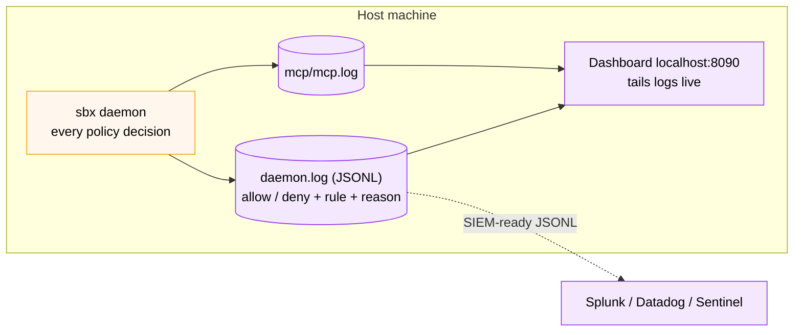

# Observability - Audit + Dashboard



*Every decision the daemon makes is already written as structured JSONL. This section reads it with `jq` and starts a live dashboard that tails it — the audit substrate that's SIEM-ready today.*

Section 05 promised Pillar 3 (Audit + Visibility) was rolling out. The good news: the foundation is already shipping. Every policy decision sbx makes is written to a structured JSONL log on disk today - and this section ships a live dashboard you'll start in **Step 3** to watch those decisions in real time.

<iframe src="http://localhost:8090" width="100%" height="600" style="border:1px solid #cbd5e1; border-radius:8px; background:#f8fafc;" loading="lazy"></iframe>

The panel above is **blank until you start the dashboard in Step 3** - it isn't running by default (it's only needed for this section). Once it's up, open it in a new tab if the embed doesn't refresh: **[http://localhost:8090](http://localhost:8090)**, then trigger a few events with the commands below and it will populate live.

This section gives you two things:

1. A way to read the underlying audit log directly with `jq`
2. The dashboard shown above - built from `labspace/kits/observability/`, which you start in Step 3

**Time:** ~10 minutes
**Prerequisites:** You completed Sections 03 and (optionally) 06.

## Step 1 - Locate the daemon log

The sbx daemon writes JSONL audit records to a `sandboxd/daemon.log` file. Locate it for your platform:

:::conditionalDisplay{variable="os" requiredValue="mac"}
```bash no-run-button
ls -lh "$HOME/Library/Application Support/com.docker.sandboxes/sandboxes/sandboxd/daemon.log"
```
:::

:::conditionalDisplay{variable="os" requiredValue="windows"}
```powershell no-run-button
Get-ChildItem "$env:LOCALAPPDATA\DockerSandboxes\sandboxes\logs\sandboxd\daemon.log"
```
:::

:::conditionalDisplay{variable="os" requiredValue="linux"}
```bash no-run-button
ls -lh "$HOME/.local/share/com.docker.sandboxes/sandboxes/sandboxd/daemon.log"
```
:::

:::conditionalDisplay{variable="os" hasNoValue}
```bash no-run-button
ls -lh "$HOME/Library/Application Support/com.docker.sandboxes/sandboxes/sandboxd/daemon.log"
```

> [!TIP]
> The path above is for macOS. On Linux it's `~/.local/share/com.docker.sandboxes/sandboxes/sandboxd/daemon.log`; on Windows it's under `%LOCALAPPDATA%\DockerSandboxes\sandboxes\logs\sandboxd\`. Pick your OS in **Section 00 - Setup** to get the exact command.
:::

## Step 2 - Read it with `jq`

Each policy decision is one JSON line. The `msg` field is `"governance policy evaluation"`, and useful fields include `resource_value`, `allowed`, `policy_matched_rule`, `policy_deny_reason`, `policy_source`.

```bash no-run-button
LOG="$HOME/Library/Application Support/com.docker.sandboxes/sandboxes/sandboxd/daemon.log"

# Last 20 policy decisions
jq -c 'select(.msg == "governance policy evaluation")' "$LOG" | tail -20

# Only denies
jq -c 'select(.msg == "governance policy evaluation" and .allowed == false)' "$LOG" | tail -20

# Count denies per rule
jq -r 'select(.msg == "governance policy evaluation" and .allowed == false) | .policy_matched_rule // "(default-deny)"' "$LOG" \
  | sort | uniq -c | sort -rn

# Explicit (rule matched) vs implicit (default-deny)
jq -r 'select(.msg == "governance policy evaluation" and .allowed == false) | .policy_deny_reason' "$LOG" \
  | sort | uniq -c
```

This is your SIEM-ready surface. Forward this file to Splunk/Datadog/Sentinel and you have an org-grade audit trail for sandbox policy decisions.

## What's captured and what isn't (reconciled with Docker's marketing)

Docker's [AI Governance page](https://www.docker.com/products/ai-governance/) describes audit events as containing "user identity, timestamp, session context, and triggering rule." Here's what v0.32.0 actually emits today, mapped against that claim:

| Marketing claim | v0.32.0 reality |
|---|---|
| Timestamp | ✅ on every event |
| Triggering rule | ✅ `policy_matched_rule` |
| Session context | ⚠️ Partial - `session`, `sandbox`, `agent`, `runtime` fields appear on lifecycle events (gateway start, sandbox spawn) but **not** on `governance policy evaluation` events |
| User identity | ❌ Not in any field today. The dashboard synthesises it from `$USER` on the host as a best-effort proxy. |
| SIEM export | ✅ JSONL is already the format |

Plus a third log file - **`mcp/mcp.log`** alongside `daemon.log` - that captures MCP gateway lifecycle events in logfmt (`setupMCPGateway called`, `gateway started in sandboxd`, etc.). The dashboard tails it as a separate source.

The audit log answers *what was decided and why*, with sandbox attribution on some events. It does not yet answer *who triggered it* across multiple users on one machine - Docker's marketing implies this is coming, but as of v0.32.0 it still isn't in any field, so the dashboard keeps synthesising the user from `$USER`.

## Step 3 - Start the dashboard

The dashboard is **not** running by default - it's only needed for this section, so you start it here. The kit at `labspace/kits/observability/` ships a self-contained compose file. From the repo root:

```bash no-run-button
cd labspace/kits/observability
docker compose --profile with-gateway up -d --build
```

> [!NOTE]
> If you cloned the repo elsewhere, `cd` to `<repo>/labspace/kits/observability` instead. The `--profile with-gateway` also brings up a local `docker/mcp-gateway` so MCP traffic shows up in the dashboard; drop the profile flag if you only want sbx policy events.

Give it a few seconds to build, then open it (or refresh the embedded panel at the top of this section):

```bash no-run-button
open http://localhost:8090
```

When you're done with this section you can stop it again with `docker compose down` from the same directory.

## Step 4 - Generate some events to watch

In another terminal, enter a sandbox and trigger denies:

```bash no-run-button
mkdir -p ~/workdemo/scratch && cd ~/workdemo/scratch
sbx run shell .
```

Inside the sandbox prompt:

```bash no-run-button
curl -sS https://collabnix.com -o /dev/null -w "%{http_code}\n"
curl -sS https://example.com -o /dev/null -w "%{http_code}\n"
curl -sS https://api.anthropic.com -o /dev/null -w "%{http_code}\n"
```

Switch to the dashboard. You'll see three new rows appear in real time:

- `paste.ee` or `collabnix.com` → `deny` with `explicit` reason and your matched rule name
- `example.com` → `deny` with `implicit` reason (default-deny)
- `api.anthropic.com` → `allow`

The per-rule deny count panel on the left updates live.

## Step 5 - Layer MCP traffic on top (optional)

If you have the Variant B MCP gateway from Section 06 running on `localhost:8811`, the dashboard automatically picks up its logs - it discovers any running container whose image name contains `mcp-gateway` and **follows its log output from the moment the dashboard attaches**.

One gotcha worth knowing: the dashboard tails *new* gateway log lines only - it does not replay history. So an **idle** gateway shows nothing under the `mcp-gateway` source; you have to send it a request *after* the dashboard is up. The block below opens an MCP session and drives a tool call through the gateway:

```bash no-run-button
# Keep an SSE session open in the background, then drive a tool call through it
curl -sN http://localhost:8811/sse > /tmp/mcp_sse.log 2>&1 &
SSE_PID=$!; sleep 1.5
URL="http://localhost:8811$(grep -m1 '^data: ' /tmp/mcp_sse.log | sed 's/^data: //' | tr -d '\r')"
curl -s -X POST "$URL" -H 'Content-Type: application/json' \
  -d '{"jsonrpc":"2.0","id":1,"method":"initialize","params":{"protocolVersion":"2024-11-05","capabilities":{},"clientInfo":{"name":"lab","version":"1.0"}}}' >/dev/null
curl -s -X POST "$URL" -H 'Content-Type: application/json' \
  -d '{"jsonrpc":"2.0","method":"notifications/initialized"}' >/dev/null
curl -s -X POST "$URL" -H 'Content-Type: application/json' \
  -d '{"jsonrpc":"2.0","id":2,"method":"tools/call","params":{"name":"search","arguments":{"query":"docker mcp gateway"}}}' >/dev/null
sleep 2; kill $SSE_PID 2>/dev/null
echo "Done - check the dashboard's mcp-gateway source."
```

Switch to the dashboard, click the **mcp-gateway** source filter, and make sure **info** is enabled under Decision (these are INFO-level events). You'll see `tool=search` / `call-tool` rows appear alongside the sbx policy rows - both signals in one screen.

## What you just demonstrated

- Pillar 3's audit substrate already ships in `sbx`: structured JSONL ready for SIEM ingestion
- A live UI can be built on top in a few hundred lines of code
- The honest gap (no user attribution, no MCP-tool-level audit yet) is now visible to your security team in the same view that shows what *is* captured

For a security review conversation, this section is the one that lands. You're not promising a feature - you're showing the structured event stream that already exists, and the work it would take to wrap it in your org's SIEM.

## Frequently asked: prompts and tool calls

The most common question after seeing this dashboard:

> *"Can it show me the prompts the agent sent and which MCP tool was called?"*

**Short answer: no, and the dashboard is intentionally honest about that.** Here's the precise breakdown.

### Prompts

Not logged. The sbx proxy does MITM TLS interception so it *could* technically read request bodies, but it only captures network metadata (destination, port, decision). No request bodies. Almost certainly a deliberate product choice - logging prompt content has privacy and legal implications.

### MCP tool calls

Only visible for gateways you run yourself, and only as heuristic log lines:

- **Mode C (local stdio):** the subprocess runs on your host; wrap it yourself if you need audit
- **Local MCP Gateway with `--verbose=true`:** the dashboard tails the gateway stdout and surfaces `call-tool` / `list-tools` classifications. Not structured per-call records.
- **Mode A (remote OAuth servers like Notion, GitHub):** invisible from your side. You see the TCP connect in sbx, you don't see which tool was called.

For structured tool-call audit, [`docker/mcp-gateway`](https://github.com/docker/mcp-gateway) would need to emit JSONL audit events. It doesn't today - file a feature request.

### Who triggered each event

The sbx daemon log has no `user`, `sandbox_id`, or `agent` field. Per-machine logs answer *what* was decided, not *who* triggered it. For org-wide audit you'd want sbx to enrich each event with `user_email` from the Docker login session - a feasible feature request, not currently shipping.

### What ships today vs roadmap

| What | Today | Roadmap |
|---|---|---|
| Network policy decisions (allow/deny/rule/reason) | ✅ JSONL in daemon.log | - |
| Filesystem mount decisions | ✅ same | - |
| User attribution | ❌ | Likely (no API change required) |
| Prompt content | ❌ | Probably never default |
| Structured MCP tool-call audit | ❌ (heuristic only) | Yes, via gateway changes |
| Hosted MCP server audit | ❌ | Part of MCP Tool Governance (Pillar 2) |
| Cross-machine aggregation | ❌ | Via SIEM ingestion of the daemon.log |

That's the entire picture you can defend to a security team.

## Where to go from here

- Forward the daemon.log to your SIEM (Splunk HEC, Datadog HTTP intake, Elastic HTTP)
- Read the kit's `README.md` for caveats and config
- Watch this space for `sbx audit` CLI and MCP-tool-level audit - both on the roadmap
