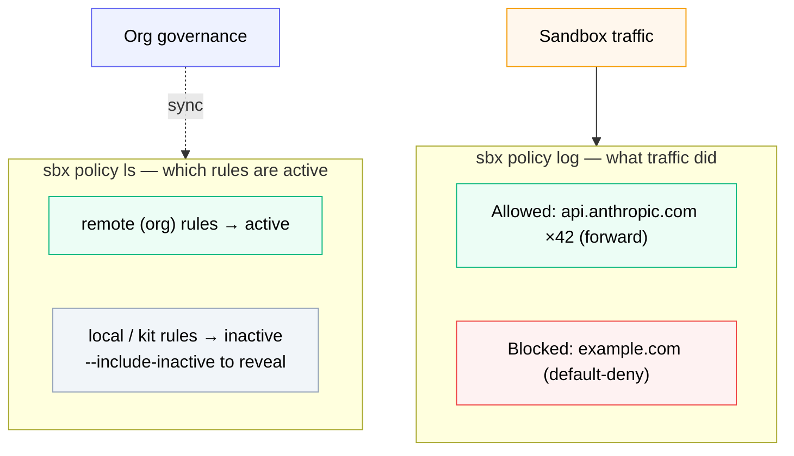

# Monitoring Policies



*Two commands are your local control surface: `sbx policy ls` shows which rules are active (org rules win, local ones go inactive), and `sbx policy log` attributes real traffic to the rule that allowed or blocked it.*

Sections 03 and 04 proved that policies *enforce*. This section is about the other half of operating governance day-to-day: **seeing what's active and what just happened**. Two `sbx` commands do almost all of the work:

- `sbx policy ls` - *what rules are in effect right now*, and where each came from
- `sbx policy log` - *which hosts your sandboxes actually contacted*, and which rule decided each one

You already met `sbx policy ls` in passing. Here we use both as your local control surface.

**Time:** ~10 minutes
**Prerequisites:** You completed Section 03 (so there's traffic to look at). Being an admin of `$$org$$` is helpful but not required for reading.

## Step 1 - List the active rules

```bash no-run-button
sbx policy ls
```

Without org governance, you see only local and kit-defined rules:

```console
$ sbx policy ls
NAME                  TYPE      ORIGIN               DECISION   STATUS   RESOURCES
balanced-dev          network   local                allow      active   api.anthropic.com
ads-block             network   local                deny       active   ads.example.com
kit:my-sandbox        network   sandbox:my-sandbox   allow      active   api.example.com
kit:my-sandbox:deny   network   sandbox:my-sandbox   deny       active   telemetry.example.com
```

The columns:

| Column | Meaning |
| --- | --- |
| `NAME` | Rule name (kit rules are prefixed `kit:`) |
| `TYPE` | `network` or `filesystem` |
| `ORIGIN` | `local` (global on this machine), `sandbox:<name>` (scoped to one sandbox), or `remote` (managed by your org) |
| `DECISION` | `allow` or `deny` |
| `STATUS` | `active` or `inactive` (suppressed by a higher-precedence policy) |
| `RESOURCES` | The hosts/ports or paths the rule covers |

## Step 2 - See what changes under org governance

When `$$org$$` enforces a centralized policy, the same command grows a governance header and the picture changes:

```console
$ sbx policy ls
Governance: managed by $$org$$
[OK] last synced 13:54:21
NAME                  TYPE      ORIGIN               DECISION   STATUS   RESOURCES
allow AI services     network   remote               allow      active   api.anthropic.com
                                                                         api.openai.com
allow Docker services network   remote               allow      active   *.docker.com
                                                                         *.docker.io
```

Two things to notice:

- **The header is your proof governance is live** - `Governance: managed by $$org$$` plus a sync timestamp. This is the same line Section 02 told you to look for.
- **Local and kit-defined rules don't disappear - they go `inactive`.** Under governance they aren't evaluated at all, so by default `sbx policy ls` hides them to reduce noise. The org rules (`ORIGIN: remote`) are the only ones doing work.

To see the suppressed local rules alongside the active org rules:

```bash no-run-button
sbx policy ls --include-inactive
```

This is the honest answer to *"are my local rules being ignored?"* - yes, and now you can see exactly which ones and why.

### Useful filters

```bash no-run-button
# Only network rules
sbx policy ls --type network

# Rules in effect for one specific sandbox
sbx policy ls my-sandbox
```

## Step 3 - Read the traffic log

`sbx policy ls` tells you the *rules*. `sbx policy log` tells you what the rules actually *did* - every host your sandboxes reached for, split into blocked vs allowed:

```bash no-run-button
sbx policy log
```

```console
$ sbx policy log
Blocked requests:
SANDBOX      TYPE     HOST                   PROXY        RULE            REASON         LAST SEEN        COUNT
my-sandbox   network  blocked.example.com    transparent  domain-blocked  default-deny   10:15:25 29-Jan  1

Allowed requests:
SANDBOX      TYPE     HOST                   PROXY          RULE             REASON   LAST SEEN        COUNT
my-sandbox   network  api.anthropic.com      forward        domain-allowed            10:15:23 29-Jan  42
my-sandbox   network  registry.npmjs.org     forward-bypass domain-allowed            10:15:20 29-Jan  18
my-sandbox   network  app.example.com        browser-open                             10:15:10 29-Jan  1
```

This is the view that connects the abstract policy to concrete behaviour. Reading the example above:

- `blocked.example.com` was **blocked** by `default-deny` - no allow rule covered it. This is exactly the `example.com: 403` you saw in Section 03, now attributed to a rule and counted.
- `api.anthropic.com` was **allowed** 42 times via the `forward` proxy - your `allow AI services` rule working at volume.
- The `PROXY` column tells you *how* traffic was handled: `forward` (proxied + inspected), `forward-bypass` (allowed straight through), `transparent`, or `browser-open` (a URL the agent asked you to open in a browser).
- `COUNT` and `LAST SEEN` make this a frequency view, not a raw firehose - repeated hits to the same host collapse into one row.

### Useful filters

```bash no-run-button
# Just one sandbox
sbx policy log my-sandbox

# Last 20 entries
sbx policy log --limit 20

# Network only
sbx policy log --type network

# Machine-readable for scripting / piping to jq
sbx policy log --json
```

## Step 4 - Generate traffic, then watch it appear

Make some decisions happen, then read them back. In a sandbox (Section 03 setup):

```bash no-run-button
mkdir -p ~/workdemo/scratch && cd ~/workdemo/scratch
sbx run shell .
```

Inside the sandbox:

```bash no-run-button
curl -sS https://api.anthropic.com -o /dev/null -w "anthropic: %{http_code}\n"
curl -sS https://paste.ee      -o /dev/null -w "paste.ee: %{http_code}\n"
curl -sS https://example.com   -o /dev/null -w "example.com: %{http_code}\n"
exit
```

Back on the host:

```bash no-run-button
sbx policy log
```

You'll see `api.anthropic.com` under **Allowed** and both `paste.ee` (matched your `deny exfiltration` rule) and `example.com` (`default-deny`) under **Blocked** - each with the rule that decided it.

## How this relates to the dashboard

Section 08 built a live dashboard by tailing the raw `daemon.log`. `sbx policy log` is the **officially supported, aggregated** version of that same information - no log parsing, no file paths, deduplicated by host with counts. Reach for:

- **`sbx policy log`** for a quick, supported "what happened" during a demo or incident
- **the dashboard / `daemon.log`** when you want every individual event live, or a UI to show a security team
- **the audit log** (next section) when you need a durable, per-event, SIEM-shippable record with user and org attribution

## What you just demonstrated

- `sbx policy ls` is the authoritative view of *which rules are active and where they came from* - and `--include-inactive` makes the suppressed-by-governance rules visible
- `sbx policy log` attributes real sandbox traffic to the rule that decided it, allow or deny, with counts
- `--json` turns both into a scriptable surface

Next: where these decisions get written down permanently - the audit log.
