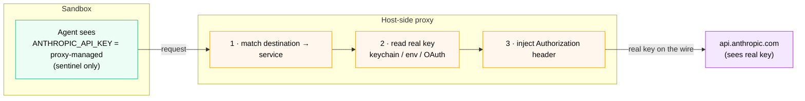

# Credential Isolation



*The agent authenticates without ever holding the key: it sees only the `proxy-managed` sentinel, while the proxy matches the service, reads the real secret from the host, and injects it per request.*

Section 04 blocked the agent from **reading** secrets off disk - `~/.ssh`, `~/.aws`, `~/.docker/config.json`. But agents legitimately need credentials: the `claude` agent has to call `api.anthropic.com`, a kit might call GitHub or your own API. So the obvious question is:

> *If the agent can't read my keys from disk, how does it authenticate to the services it's allowed to use?*

The answer is **credential isolation**. The real secret never enters the sandbox. A host-side proxy injects it per request, and the sandbox sees only a sentinel value like `proxy-managed`. Section 04 stops secret *theft*; this section makes the agent *use* a secret it can never see.

> [!NOTE]
> **This is a different kind of control from Sections 03-04.** Network and filesystem rules are **admin-governed** org policies (`ORIGIN: remote`, default-deny, developers can't override). Credential isolation is a **sandbox runtime protection** you configure **developer-side** with `sbx secret`, the OS keychain, or OAuth. It complements Pillar 1 rather than being one of its policies - there's no Admin Console toggle for it.

**Time:** ~10 minutes
**Prerequisites:** You completed Section 03 (network policy active, `allow AI services` covers `api.anthropic.com`).

## What you'll prove

- The real API key **never enters the sandbox** - the agent sees a sentinel value
- The host-side proxy **injects** the real credential per request for allowed services
- Secrets can live in the **OS keychain** instead of being exported as plaintext env vars
- **Custom secrets** extend the same mechanism to non-standard APIs

## How credential isolation works

Every outbound request from a sandbox passes through the same egress proxy that enforces your network rules. For a request to a known service, the proxy does three things the sandbox can't:

1. **Match** the destination to a declared service (e.g. `api.anthropic.com` → `anthropic`)
2. **Read** the real credential from the host (keychain, env var, or OAuth token)
3. **Inject** it as an HTTP header on the outbound request

```
Sandbox                          Host-side proxy                  Service
ANTHROPIC_API_KEY=proxy-managed  ──▶  reads real key from   ──▶  api.anthropic.com
(sentinel only)                       keychain, injects            (sees real key)
                                      Authorization header
```

The sentinel (`proxy-managed`) is all the sandbox - and therefore the agent, a prompt injection, or a leaky log - can ever see. The live secret stays on the host.

The proxy already knows the common providers:

| Service | Env var(s) | Domain(s) |
| --- | --- | --- |
| `anthropic` | `ANTHROPIC_API_KEY` | `api.anthropic.com` |
| `openai` | `OPENAI_API_KEY` | `api.openai.com` |
| `github` | `GH_TOKEN`, `GITHUB_TOKEN` | `api.github.com`, `github.com` |
| `aws` | `AWS_ACCESS_KEY_ID` | AWS Bedrock endpoints |

Kits declare additional services in their `spec.yaml` (covered in the kit-authoring track).

## Step 1 - See the sentinel inside a sandbox

Launch a sandbox in your lab directory:

```bash no-run-button
mkdir -p ~/workdemo/creds && cd ~/workdemo/creds
sbx run shell .
```

Inside the sandbox prompt, look at the credential the `claude` agent would use:

```bash no-run-button
echo "ANTHROPIC_API_KEY=$ANTHROPIC_API_KEY"
```

**Expected:**

```
ANTHROPIC_API_KEY=proxy-managed
```

The variable exists - tools inside the sandbox expect it - but its value is the sentinel, not a real key. There is no live secret anywhere in the sandbox's environment, filesystem, or process memory.

Stay in the sandbox for the next step.

## Step 2 - Watch the proxy inject the real credential

Still inside the sandbox, make a request to an allowed AI service:

```bash no-run-button
curl -sS https://api.anthropic.com -o /dev/null -w "anthropic: %{http_code}\n"
```

The request succeeds (the `allow AI services` rule from Section 03 covers it). Now exit and inspect the proxy log on the **host**:

```bash no-run-button
exit
sbx policy log | grep -i anthropic | tail -5
```

You'll see the request to `api.anthropic.com` logged as `forward`. The proxy matched the destination to the `anthropic` service, read your real key from the host, and injected the `Authorization` header - all without the key ever touching the sandbox. The sentinel inside, the real key on the wire: that's credential isolation working.

## Step 3 - Store the secret in the keychain (preferred over env vars)

There are two ways to give the proxy your real credential. The quick one is an environment variable on the host:

```bash no-run-button
export ANTHROPIC_API_KEY=sk-ant-...   # plaintext, read from your shell session
```

This works, but the key sits in your shell history and process environment in plaintext. The hardened path stores it in the OS keychain instead:

```bash no-run-button
sbx secret set -g anthropic
```

- `-g` scopes the secret **globally** (every sandbox you launch); omit it and pass a sandbox name to scope it to one sandbox.
- You're prompted for the value at a silent prompt - it never appears on screen or in history.
- It's written to the OS secret store (macOS System Keychain, Windows Credential Manager, Linux Secret Service or an encrypted file).
- Keychain secrets **take precedence** over env vars.

List what's stored:

```bash no-run-button
sbx secret ls
```

> [!WARNING]
> **Global secrets apply at sandbox *creation* time.** If you change a global secret, recreate the sandbox to pick it up. Sandbox-scoped secrets take effect immediately. Either way, **never set a real API key from inside a sandbox** - the agents are pre-wired for proxy injection, and doing so would defeat the isolation.

OAuth is supported too, for providers that offer it - the sign-in happens on the host and the token never enters the sandbox:

```bash no-run-button
sbx secret set -g openai --oauth
```

## Step 4 - Custom secrets for your own APIs

The built-in service map covers the big providers. For an internal API or any non-standard auth flow, declare a **custom secret** keyed to a host and an env var name:

```bash no-run-button
sbx secret set-custom -g --host api.internal.example.com --env INTERNAL_API_KEY --value "$(cat ~/key.txt)"
```

- `--host` accepts wildcards: `*.example.com`, `**.example.com`.
- Inside the sandbox, `INTERNAL_API_KEY` shows a placeholder; the proxy substitutes the real value on requests to the matching host.
- Pipe or command-substitute the value rather than typing it inline, so it stays out of your shell history.

> [!NOTE]
> Custom secrets are **experimental** - the placeholder format may change. For the built-in providers in the table above, prefer `sbx secret set`.

## Related: registry credentials and SSH

Two more credentials flow through the same isolation model:

- **Registry auth** - `sbx secret set --registry ghcr.io --password-stdin` (pipe a token). Host-only by default (used by the CLI to pull templates/kits); add `-g` to write it into `~/.docker/config.json` *inside* the sandbox so the agent can pull images.
- **SSH agent forwarding** - if your host has an SSH agent (`SSH_AUTH_SOCK` set), it's forwarded into the sandbox. Processes inside can **request signatures** from the agent, but **can't read or copy the private key**. This is the using-without-seeing principle from Step 1, applied to SSH - and the direct complement to the `~/.ssh/**` deny rule from Section 04.

## Read the results

| What | Where the secret lives | What the sandbox sees |
| --- | --- | --- |
| `ANTHROPIC_API_KEY` (Step 1) | Host keychain / env var | `proxy-managed` sentinel |
| Allowed API call (Step 2) | Injected by proxy on the wire | Never the raw value |
| Keychain secret (Step 3) | OS secret store | Sentinel; real value injected per request |
| Custom secret (Step 4) | Host, keyed to host + env | Placeholder; substituted per request |
| SSH key | Host SSH agent | Can sign, can't read the key |

## What you just demonstrated

The sandbox authenticates to every service it's allowed to reach **without ever holding the live credential**. The real secret stays on the host; the proxy injects it per request; the sandbox sees only a sentinel.

This closes a gap that network and filesystem rules alone leave open. Section 04 stops the agent from *stealing* secrets at rest. Credential isolation means that even for the calls the agent is *supposed* to make, a prompt injection or a leaky log can't exfiltrate a usable key - because there is no usable key inside the box to begin with.

The three sandbox protections together:

- **Network egress** (03) - the agent can't reach unapproved destinations
- **Filesystem access** (04) - the agent can't mount unapproved paths
- **Credential isolation** (this section) - the agent can't see the secrets it uses

Move on to the Product Catalog to see governance applied to a realistic multi-service stack.
