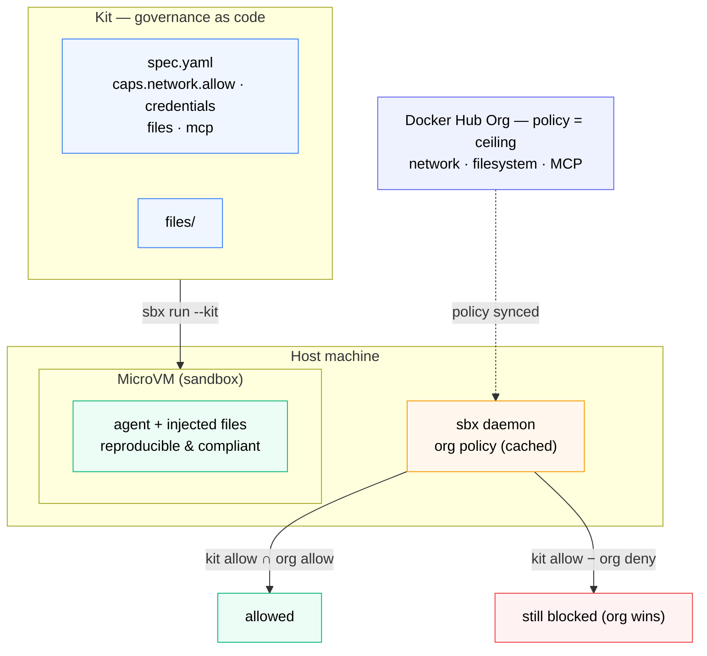

# Sandbox Kits - Governance as Code



*A kit packages a reproducible sandbox declaratively — but it's developer-side convenience under the org ceiling: a kit can make an approved setup reproducible, it can't grant access the CISO's policy denies.*

The last three sections were the **admin's** view: network, filesystem, and MCP policies authored in Docker Hub and enforced on every sandbox in `$$org$$`. This section is the **developer's** view - how you package a sandbox that's reproducible and compliant *by construction*, instead of a pile of `sbx run` flags and a setup doc.

The answer is a **kit**: a declarative artifact - a `spec.yaml` plus an optional `files/` directory - that bundles everything a sandbox needs: tools to install, files to inject, network rules, credential wiring, and the agent itself. This is the governance-level overview; the sections that follow build kits hands-on.

**Time:** ~4 minutes (overview)
**Prerequisites:** Sections 03, 04, and 06.

## Why kits matter for governance

You already met every property a kit packages - kits just make them **declarative, composable, and shareable**:

| Property | You saw it in | A kit makes it... |
| --- | --- | --- |
| Egress allowlist | Network (03) | a few lines of `caps.network.allow` in `spec.yaml` |
| Credentials never enter the VM | Credential Isolation (12) | a `credentials` block with `apiKey.inject`, wired once |
| One governed MCP endpoint | MCP (06) | servers declared in the kit, attached at creation |
| Reproducible workspace | Filesystem (04) | static `files/` injected into the workspace |

Instead of "clone this, export that, remember `--kit` twice," a teammate runs **one command** and gets your exact, governed setup.

## Two kinds of kits

**Mixin kits** (`kind: mixin`) extend an existing agent - add a tool, drop in config, grant a new service. Stack several with multiple `--kit` flags.

**Agent kits** (`kind: sandbox` in kit-spec v2) define a full agent from scratch - image, entrypoint, network, credentials. The built-in `claude` you've been using is itself an agent kit; you can fork it and change one thing.

## What a kit can declare

| Field | What it does |
| --- | --- |
| `caps.network.allow` | Domains the sandbox may reach |
| `credentials` (list) | Per-service secrets the proxy injects via `apiKey.inject` - never in the VM |
| `files/` | Static files injected into the workspace or `/home/agent/` |
| `commands.install` | Runs once at creation - installs tools |
| `commands.startup` | Runs on every start - background services |

## What a kit looks like

A kit can be as small as a `spec.yaml` plus one file - here, a mixin that ships a Claude Code skill into the workspace:

```yaml
# kits/docker-review/spec.yaml
schemaVersion: "2"
kind: mixin
name: docker-review
displayName: Dockerfile review skill
description: Ships a Claude Code skill that reviews Dockerfiles
```

A teammate runs it - stacked on the built-in agent - with a single flag:

```bash no-run-button
sbx run claude --kit ./kits/docker-review/
```

Real deployments **layer** several mixins - a security baseline, a language toolchain, an org-config kit - and stack them with repeated `--kit` flags: `caps.network.allow` lists are unioned and every `files/` tree is injected. You build all of this hands-on in the sections that follow.

## The governance ceiling: kits don't widen policy

This is the point that ties kits back to the last three sections. A kit's `caps.network.allow` entries are **additive on top of what's already allowed** - but when `$$org$$` owns a rule type, **org policy is the ceiling**. A domain your kit lists that the org policy doesn't allow stays **blocked** (default-deny; local rules go inactive because *corporate policy takes precedence* - Section 02).

> [!IMPORTANT]
> Kits are developer-side convenience; **org governance is authoritative.** A kit can make an *approved* setup reproducible - it cannot grant an agent access the CISO's policy denies. Network, filesystem, and MCP policy all still win. That's the whole point: developers move fast *inside* the guardrails.

## How kits map to the three pillars

| Pillar | Enforced by (admin) | Packaged by (kit) |
| --- | --- | --- |
| Network | Org network policy | `caps.network.allow` (within the org ceiling) |
| Credential | Proxy injection | `credentials` block with `apiKey.inject` |
| MCP | Cedar allow-list at the gateway | servers declared / attached by the kit |
| Filesystem | Org filesystem policy | `files/` workspace injection (within allowed paths) |

## Where this goes next

The sections that follow are the hands-on kit-authoring track:

- **Kits: Introduction** - the two kinds of kits and the full capability surface
- **Kits: Your First Mixin** - build the `docker-review` skill kit end to end
- **Kits: Network & Credentials** - egress rules and proxy-managed credential injection
- **Kits: Fork an Agent Kit** - fork `claude` to require approval on every tool call
- **Kits: Stacking & Distribution** - stack kits and share via Git URL or OCI registry
- **Kits: Summary** - what kits give you that shell scripts don't

Reference: **[docs.docker.com/ai/sandboxes/customize/kits](https://docs.docker.com/ai/sandboxes/customize/kits/)** · community kits: **[github.com/docker/sbx-kits-contrib](https://github.com/docker/sbx-kits-contrib)**

With policies enforced by the org and kits packaging compliant setups for developers, you've seen both sides of the model. Build your first kit next.
