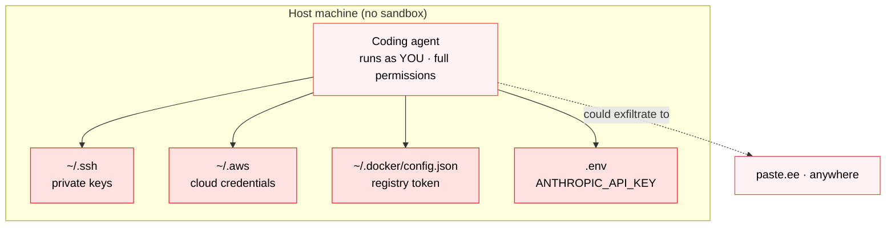

# The Problem Statement



*No boundary, no policy, no audit. The agent is you — it reads every secret on disk and could send them anywhere. This is the blast radius the rest of the lab closes.*

Section 01 made the argument: an AI agent runs with your full blast radius. This section makes it **visceral** — you'll run a coding agent directly on your host, with no sandbox, and watch it walk straight into your secrets. Nothing stops it, because nothing is watching.

**Time:** ~5 minutes

**Prerequisites:** A coding agent installed on your host (e.g. Claude Code). No `sbx` yet, that's the whole point.

## What you'll see

An unsandboxed agent, running as *you*, reading credentials off your host: cloud keys, API tokens, SSH private keys. The exact access a prompt-injected or buggy agent already has — except here you ask for it directly, so the risk is impossible to miss.

> [!WARNING]
> Run this on a machine you own, against your own files, to understand your own exposure. The goal is to *see* the blast radius before you learn to contain it.

## Step 1 - Run an agent directly on your host

No sandbox. Just the agent, in your real home directory, with your real permissions:

```bash no-run-button
cd ~
curl -fsSL https://chatgpt.com/codex/install.sh | sh
codex
```

This is how most people run coding agents today: straight on the metal — or in a container that still bind-mounts their home directory and environment.

## Step 2 - Ask it to go find your secrets

Inside the agent, paste:

```
Search my home directory for API keys, cloud credentials, and SSH private keys —
check ~/.aws, ~/.ssh, ~/.docker, ~/.config/gcloud, and any .env files. Show me
what you found and the exact file paths.
```

## Step 3 - Read what came back

The agent happily reports something like:

```
Found credentials in several locations:
  ~/.aws/credentials         → AWS access key AKIA…************ + secret
  ~/.ssh/id_ed25519          → OpenSSH private key
  ~/.docker/config.json      → registry auth token
  ~/.config/gcloud/…         → GCP OAuth credentials
  ~/work/app/.env            → ANTHROPIC_API_KEY=sk-ant-************
```

It read every one of them. There was:

- **No boundary** — the agent has your entire filesystem, because it *is* you.
- **No policy** — nothing decided those paths were off-limits.
- **No audit** — no record that a secret was just read.

## Why this is the real threat model

Here *you* asked for it. But the same access is there when you didn't:

- A **prompt-injected** agent follows hidden instructions in a web page or issue, does exactly this, and uploads the results.
- A **malicious or buggy MCP server** reads the same files as a side effect of a "helpful" tool call.
- An agent acting on **hallucinated instructions** leaks or deletes with no attacker involved at all.

"Don't run untrusted agents" doesn't scale — developers want agents, and they'll run them. The fix isn't trust. It's a **boundary the agent physically cannot cross**.

That boundary is a sandbox. Next: **Sandboxing the Agent**.
