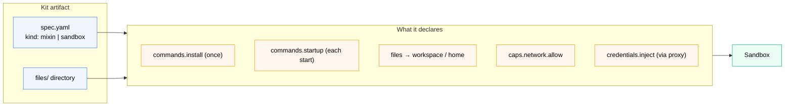

# Introduction to Docker Sandbox Kits

*A kit is a `spec.yaml` + optional `files/` that declares everything a sandbox needs — tools, files, network rules, credentials — as one shareable artifact.*

So far in this labspace you've been running agents directly with `sbx run`. That works great for one-off sessions. But what happens when you want to:

- Give every sandbox the same linting rules?
- Make sure a specific API's credentials never enter the VM?
- Share your exact sandbox setup with a teammate in one command?

That's what **kits** solve. A kit is a declarative artifact - a `spec.yaml` file plus an optional `files/` directory - that packages everything a sandbox needs: tools to install, files to inject, network rules to enforce, and credentials to wire up through the proxy.

## Two kinds of kits

**Mixin kits** (`kind: mixin`) extend an existing agent. You can stack several on the same sandbox with multiple `--kit` flags. Use these for adding tools, dropping in config files, or granting access to a new service.

**Agent kits** (`kind: sandbox` in kit-spec v2) define a full agent from scratch - image, entrypoint, network policy, credentials, everything. The built-in `claude` agent you've been using is itself defined as a kit. You can fork it and change just what you need.

## What a kit can do

| Capability | What it means in practice |
|---|---|
| `commands.install` | Runs once at sandbox creation - installs tools, downloads binaries |
| `commands.startup` | Runs every time the sandbox starts - launches background services |
| `files/` directory | Static files dropped into `/home/agent/` or the workspace at creation |
| `caps.network.allow` | Domains the sandbox can reach; everything else is blocked |
| `credentials[].apiKey.inject` | The proxy reads the secret on the host and injects it per request - it never enters the VM |

In the sections that follow, you'll build two real kits and run them against this workspace.
