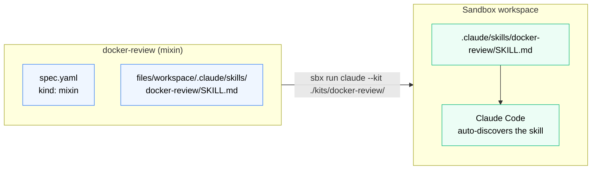

# Your First Mixin Kit: Dockerfile Review Skill



*A pure file-based mixin: the `files/workspace/` tree is injected at creation, Claude Code finds the skill in `.claude/skills/`, and uses it automatically — no install commands, no shell.*

In this section you'll build a mixin kit that ships a Claude Code skill into the sandbox workspace. Claude Code picks up skills automatically from `.claude/skills/` in the workspace, so any kit that drops a `SKILL.md` file there is immediately usable when the agent starts.

## The kit structure

```
kits/docker-review/
├── spec.yaml
└── files/
    └── workspace/
        └── .claude/
            └── skills/
                └── docker-review/
                    └── SKILL.md
```

The `files/workspace/` tree maps directly to the sandbox workspace path. Everything inside it is injected at sandbox creation - no install commands, no staging directory workaround.

## Create the spec

Create `kits/docker-review/spec.yaml`:

```yaml
schemaVersion: "2"
kind: mixin
name: docker-review
displayName: Dockerfile review skill
description: Ships a Claude Code skill that reviews Dockerfiles for best practices
```

That's the entire spec. No network rules needed, no install commands - just the skill file injection handled by the `files/` tree.

## Create the skill

Create `kits/docker-review/files/workspace/.claude/skills/docker-review/SKILL.md`:

```markdown
---
name: docker-review
description: Review a Dockerfile for best practices. Use when the user asks to review, audit, or improve a Dockerfile.
---

When reviewing a Dockerfile, check:

1. **Base image** - pinned tag or digest, minimal and appropriate for the workload
2. **Layer order** - dependencies before application source to maximise cache reuse
3. **Image size** - multi-stage builds, `.dockerignore`, package-manager cache flags (`--no-cache`, `--no-install-recommends`)
4. **Security** - non-root `USER`, no secrets in `ARG`/`ENV`, no `--privileged`
5. **Reproducibility** - pinned package versions, explicit `COPY` targets
```

## Run it

From the repo root:

```bash
sbx run claude --kit ./kits/docker-review/ --name kits-lab
```

Once Claude loads, ask it:

```
Review the Dockerfile in this workspace
```

You should see the `docker-review` skill load and Claude use it to structure the review. Notice that Claude can see all the Dockerfiles in your bind-mounted workspace - that's expected. The sandbox isolates everything *outside* the workspace, not what's inside it.

## What just happened

- The `files/workspace/` tree was injected into the workspace at sandbox creation
- Claude Code discovered the skill at `.claude/skills/docker-review/SKILL.md`
- The skill loaded and Claude used it automatically when you asked for a Dockerfile review
- Nothing was installed, no shell commands ran - the kit is entirely file-based

> **Tip:** Run `sbx kit validate ./kits/docker-review/` before running to catch any spec errors early.
