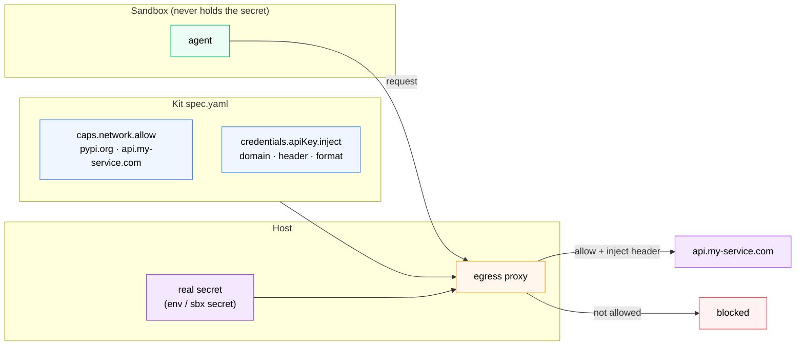

# Network Control and Proxy-Managed Credentials



*The kit declares egress rules and a credential source; the proxy enforces the allowlist and injects the secret per request. The raw value stays on the host — the same isolation as the Credential Isolation section, now declarative.*

The docker-review kit needed no network access. Most real kits do - they need to reach a package registry during install, or call an external API at runtime. This section covers how to declare those rules and wire up credentials so they never enter the VM.

## How network control works

Every sandbox has an egress proxy. All outbound traffic from the sandbox goes through it. By default, a kit's `caps.network.allow` entries are additive - they extend whatever the base network policy allows.

```yaml
caps:
  network:
    allow:
      - pypi.org
      - files.pythonhosted.org
    deny:
      - telemetry.example.com   # explicit block even if another policy permits it
```

Use `sbx policy log` to see every request the proxy handled - essential for debugging blocked domains during install.

## How credential injection works

Here's the security property that makes kits more rigorous than a shell script: **the raw credential never enters the VM**.

Instead:
1. You declare a credential source in the kit - where the proxy should look on the host
2. The proxy reads it at request time
3. The proxy injects it as an HTTP header on matching outbound requests
4. The agent inside the sandbox never sees the raw value

```yaml
caps:
  network:
    allow:
      - api.my-service.com          # let the sandbox reach the API
credentials:
  - name: my-service                # secret resolved on the host by this name
    apiKey:                         #   (a host env var, or `sbx secret set my-service`)
      inject:
        - domain: api.my-service.com
          header: Authorization
          format: "Bearer %s"       # proxy injects this header, per request
```

The raw value stays on the host, keyed by the credential `name`; the proxy substitutes it on outbound requests to the matching `domain`. The sandbox never holds the secret - the same isolation you proved in the Credential Isolation section.

## Try it: verify Anthropic credential injection

The built-in `claude` agent already uses this pattern. Run:

```bash
sbx policy log
```

You'll see requests to `api.anthropic.com` logged as `forward` with the credential injected by the proxy. The API key is never written to the VM's environment - it's substituted per-request.

## Compare: shell script vs kit

| | Shell script (claude-sbx) | Kit |
|---|---|---|
| Egress rules | Edit `config/allowlist.txt` + reload | Declare in `spec.yaml`, enforced at creation |
| API key | Must be exported to shell environment | Stays on host, proxy injects per-request |
| Credential scope | Global to the session | Per-service, per-domain |
| Sharing rules | Copy file, document setup | `--kit` flag or Git URL |
