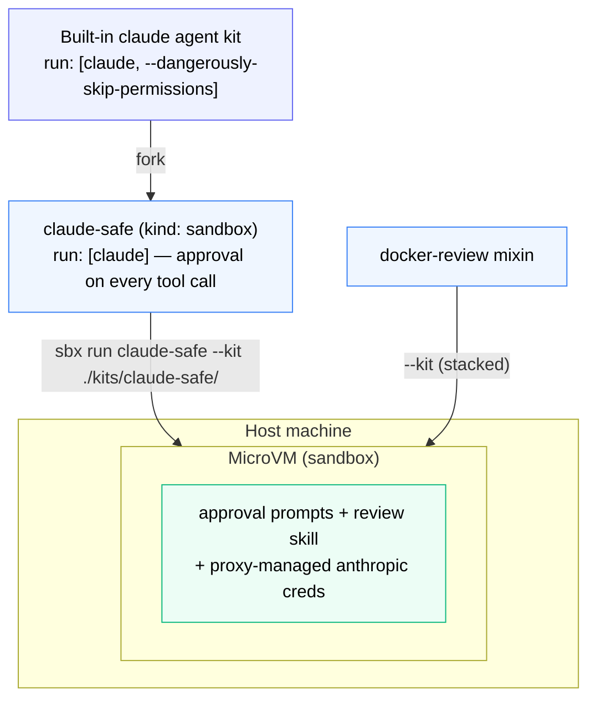

# Fork an Agent Kit: Claude Without --dangerously-skip-permissions



*An agent kit defines an agent from scratch. Here you fork the built-in `claude` to drop `--dangerously-skip-permissions`, then stack the mixin on top — agent kit + mixin compose in one sandbox.*

Mixin kits extend existing agents. Agent kits (`kind: sandbox` in kit-spec v2) define one from scratch. The most common use case is forking a built-in agent to change one thing - the entrypoint, the model, or a network rule.

This section forks the built-in `claude` agent to remove `--dangerously-skip-permissions`, giving you a version where every tool call requires explicit approval.

## Create the agent kit

Create `kits/claude-safe/spec.yaml`:

```yaml
schemaVersion: "2"
kind: sandbox                 # kit-spec v2 renamed 'agent' to 'sandbox'
name: claude-safe
displayName: Claude Code (with approval prompts)
description: Claude Code without --dangerously-skip-permissions - every tool call requires approval

sandbox:
  image: "docker/sandbox-templates:claude-code-docker"
  aiFilename: CLAUDE.md
  entrypoint:
    run: [claude]   # no --dangerously-skip-permissions

caps:
  network:
    allow:
      - api.anthropic.com
      - console.anthropic.com
      - "claude.com:443"

credentials:
  - name: anthropic
    apiKey:
      inject:
        - domain: api.anthropic.com
          header: x-api-key
        - domain: console.anthropic.com
          header: x-api-key
```

## Run it

```bash
sbx run claude-safe --kit ./kits/claude-safe/
```

The agent argument to `sbx run` matches the `name:` field in the spec - not the directory name.

## Stack it with the docker-review mixin

Agent kits and mixin kits compose. Run the `claude-safe` agent with the `docker-review` skill loaded on top:

```bash
sbx run claude-safe --kit ./kits/claude-safe/ --kit ./kits/docker-review/
```

You now have:
- Approval prompts on every tool call (from the agent kit)
- The Dockerfile review skill available (from the mixin kit)
- Proxy-managed Anthropic credentials (from the agent kit)
- All the workspace files visible via bind-mount

## Key agent kit fields

| Field | Notes |
|---|---|
| `sandbox.image` | Must provide a non-root `agent` user at UID 1000 with passwordless sudo |
| `sandbox.entrypoint.run` | Replaces the image's entrypoint entirely |
| `sandbox.entrypoint.args` | Appended to the image's existing entrypoint |
| `sandbox.aiFilename` | Memory file the agent reads at startup (e.g. `CLAUDE.md`, `AGENTS.md`) |
| `memory` | Markdown appended to the memory file at sandbox creation |

> **Note:** Agent kits require the image to expose a non-root `agent` user at UID 1000. Build on `docker/sandbox-templates:shell-docker` to get this for free if you're building a custom image. (`persistence` from kit-spec v1 is removed in v2 - it had no effect.)
