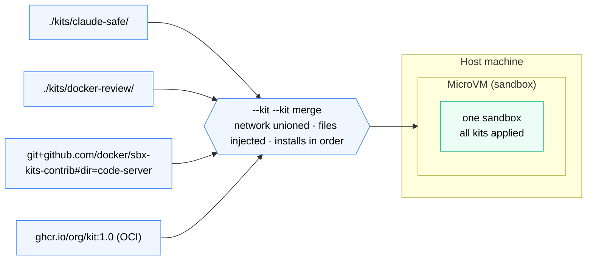

# Stacking Kits and the Community Repo



*Pass `--kit` repeatedly to stack kits — local, Git URL, or OCI image. Their rules merge: allowlists unioned, files injected, installs run in order.*

## Stacking with --kit --kit

Pass `--kit` more than once to stack kits on the same sandbox. Rules from all kits are merged: `caps.network.allow` entries are unioned, files from all kits are injected, install commands from all kits run in order.

```bash
# two local kits
sbx run claude --kit ./kits/claude-safe/ --kit ./kits/docker-review/

# local kit + community kit from Git
sbx run claude \
  --kit ./kits/docker-review/ \
  --kit "git+https://github.com/docker/sbx-kits-contrib.git#dir=code-server"
```

> **Important:** `--kit` only applies when creating a new sandbox. To add a kit to a running sandbox use `sbx kit add`:
> ```bash
> sbx kit add kits-lab ./kits/docker-review/
> ```
> This re-runs install commands and re-copies files. Kits can't be removed from a running sandbox - `sbx rm` and recreate to start clean.

## Loading from the community repo

`docker/sbx-kits-contrib` is the official community kits repository. Every kit in it has TCK tests running in CI. Load any kit directly without cloning:

```bash
# VS Code in the browser with Claude Code extension
sbx run claude --kit "git+https://github.com/docker/sbx-kits-contrib.git#dir=code-server"

# Pin to a specific tag for reproducibility
sbx run claude --kit "git+https://github.com/docker/sbx-kits-contrib.git#ref=v0.2.0&dir=code-server"
```

Available kits in the repo: `code-server`, `amp`, `openclaw`, `nanoclaw`, `nanobot`, `pi`.

## Packaging and distributing your own kit

Once your kit works locally, share it three ways:

**ZIP file:**
```bash
sbx kit pack ./kits/docker-review/ -o docker-review-1.0.zip
```

**OCI registry:**
```bash
sbx kit push ./kits/docker-review/ ghcr.io/yourorg/docker-review:1.0
# teammates run:
sbx run claude --kit ghcr.io/yourorg/docker-review:1.0
```

**Git URL** (simplest for teams):
```bash
# just commit the kit directory to your repo, then:
sbx run claude --kit "git+https://github.com/yourorg/yourrepo.git#dir=kits/docker-review"
```

## Debugging kit issues

| Command | When to use |
|---|---|
| `sbx kit validate ./kits/my-kit/` | Before running - catches spec errors |
| `sbx policy log` | Blocked domains, install failures, credential injection |
| `sbx exec kits-lab -- which ruff` | Verify a tool landed after install |
| `sbx exec kits-lab -- ls /home/agent/.local/bin/` | Inspect agent-user bin path |
| `sbx rm kits-lab && sbx run …` | Clean recreate - fastest reset loop |
