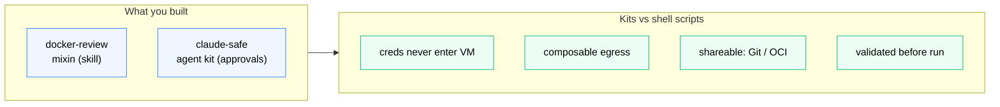

# Summary and Next Steps



*Two real kits built — a mixin and an agent kit — packaging what shell scripts can't: credentials that never enter the VM, composable egress, and Git/OCI sharing.*

## What you built

In this section you went from running agents directly to packaging sandbox environments as declarative, shareable kits.

| What you did | How |
|---|---|
| Shipped a Claude Code skill into the sandbox | Mixin kit with `files/workspace/` injection |
| Understood proxy-managed credential injection | `credentials[].apiKey.inject` |
| Forked the built-in `claude` agent | Agent kit with custom entrypoint |
| Stacked two kits on one sandbox | `--kit --kit` |
| Pulled a kit from the community repo | `git+https://github.com/docker/sbx-kits-contrib.git#dir=…` |

## The files you created

```
kits/
├── docker-review/
│   ├── spec.yaml
│   └── files/
│       └── workspace/
│           └── .claude/skills/docker-review/SKILL.md
└── claude-safe/
    └── spec.yaml
```

These are real, working kits. Commit them to this repo and anyone can use them with a single `--kit` flag.

## What kits give you that shell scripts don't

- **Credentials never enter the VM** - the proxy reads them from the host and injects per-request
- **Composable egress rules** - stack kits without mutating a shared allowlist file
- **Shareable via Git URL or OCI registry** - no clone, no setup doc, no config dance
- **Validated before run** - `sbx kit validate` catches spec errors before they waste a sandbox creation
- **TCK-testable** - write a Go test file using `tck.NewSuiteFromDir` and CI validates your kit against a real container

## Next steps

- Browse the community kits: [github.com/docker/sbx-kits-contrib](https://github.com/docker/sbx-kits-contrib)
- Read the full spec reference: [docs.docker.com/ai/sandboxes/customize/kits](https://docs.docker.com/ai/sandboxes/customize/kits/)
- Build an agent kit from scratch: [docs.docker.com/ai/sandboxes/customize/build-an-agent](https://docs.docker.com/ai/sandboxes/customize/build-an-agent/)
- Contribute a kit to the community repo - the CONTRIBUTING.md explains the process
